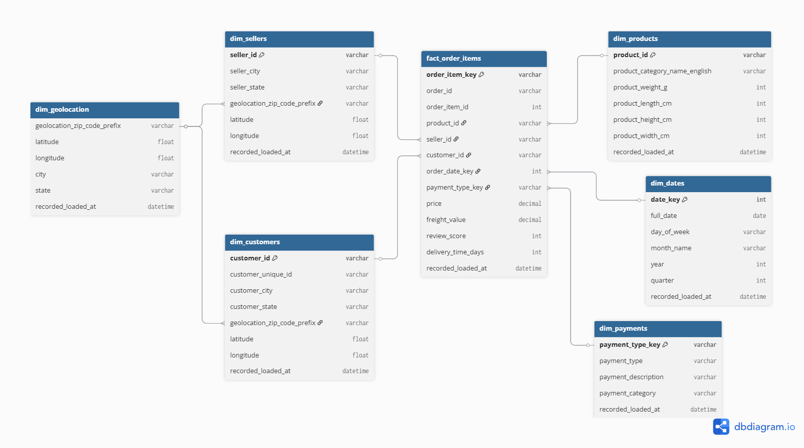

# End-to-End Kimball Methodology for Olist e-commerce dataset #

In this section, we will perform the following steps of the End-to-End ELT Pipeline.

**Step 2: Target Production Schema Design**

- **Tool:** ERD
- **Action:** Target production schema design is finalised as part of Exploratory Data Analysis (EDA) and Star Schema Design document.
- **Output:** A well documented Star Schema diagram and document to guide the Transformation step.

## 1: Select the Business Process
The core business process we will model is **e-commerce sales transactions**. This is the fundamental event that drives revenue and is of primary interest to stakeholders across the business, from finance to marketing.

**Chosen Process**  
Sales Transactions

**Rationale**
This process is atomic, generates key numeric facts like price and freight value, and directly represents the core business activity. The available data in the tables below provides the perfect foundation.

- olist_orders_dataset.csv  
- olist_order_items_dataset.csv  
- olist_order_payments_dataset.csv  


---

## 2: Declare the Grain
The grain defines the level of detail for each row in our fact table.

**Chosen Grain**  
One row per order item

**Rationale**
This is the most granular level available in the data. It allows us to analyze every individual product within a transaction, rather than just the total order. This grain provides maximum flexibility for analysis, from product-level profitability to basket analysis (items bought together).

---

## 3: Identify Dimensions
Dimensions provide the descriptive context for the facts. By joining the various CSV files, we can create comprehensive dimension tables.

- **Who?**: Customer and Seller.  
- **What?**: Product (including category and physical attributes) and Payment information.  
- **When?**: A Date dimension can be derived from the multiple timestamps in the orders and reviews datasets.  
- **Where?**: Geolocation for both customers and sellers.  

### Resulting Dimension Tables:
- dim_customers: customer_unique_id, customer_city, customer_state.  
- dim_products: product_id, product_category_name (with a translation lookup), product_weight_g, product_length_cm, product_height_cm, product_width_cm.  
- dim_sellers: seller_id, seller_city, seller_state.  
- dim_dates: date, day_of_week, month, year, quarter.  
- dim_payments: payment_type.  

---

## 4: Identify Facts (Aligned with Fact Table)
Facts are the numeric, additive (or semi-additive) measures that result from the business process.  

### Core Facts (Additive):
- **price** — The price of the product per line item (from olist_order_items_dataset).  
- **freight_value** — The shipping cost per line item (from olist_order_items_dataset).  

### Derived Facts (Semi-additive or Calculated):
- **delivery_time_days** — Days between order purchase and delivery (from olist_orders_dataset).  
- **review_score** — Customer review rating for the order (from olist_order_reviews_dataset).  

> **Note:** `total_payment_value` is not included in this fact table because it exists at the order level, not the order item level. It can be derived by joining with `olist_order_payments_dataset` if needed.

---

## Star Schema Definition (DBML)

https://dbdiagram.io/d/Team2_Schema-68c021c261a46d388e30d8e0

```sql
// Fact Table
Table fact_order_items {
  order_item_key varchar [pk]
  order_id varchar 
  order_item_id int
  product_id varchar
  seller_id varchar
  customer_id varchar
  order_date_key int
  payment_type_key varchar
  price decimal
  freight_value decimal
  review_score int
  delivery_time_days int
  recorded_loaded_at datetime
}

// Dimension Tables

Table dim_customers {
  customer_id varchar [pk]
  customer_unique_id varchar
  customer_city varchar
  customer_state varchar
  geolocation_zip_code_prefix varchar
  latitude float
  longitude float
  recorded_loaded_at datetime
}

Table dim_products {
  product_id varchar [pk]
  product_category_name_english varchar
  product_weight_g int
  product_length_cm int
  product_height_cm int
  product_width_cm int
  recorded_loaded_at datetime
}

Table dim_sellers {
  seller_id varchar [pk]
  seller_city varchar
  seller_state varchar
  geolocation_zip_code_prefix varchar
  latitude float
  longitude float
  recorded_loaded_at datetime
}

Table dim_dates {
  date_key int [pk]
  full_date date
  day_of_week varchar
  month_name varchar
  year int
  quarter int
  recorded_loaded_at datetime
}

Table dim_payments {
  payment_type_key varchar [pk]
  payment_type varchar
  payment_description varchar
  payment_category varchar
  recorded_loaded_at datetime
}

Table dim_geolocation {
  geolocation_zip_code_prefix varchar
  latitude float
  longitude float
  city varchar
  state varchar
  recorded_loaded_at datetime
}

// Relationships
Ref: fact_order_items.product_id > dim_products.product_id
Ref: fact_order_items.seller_id > dim_sellers.seller_id
Ref: fact_order_items.customer_id > dim_customers.customer_id
Ref: fact_order_items.order_date_key > dim_dates.date_key
Ref: fact_order_items.payment_type_key > dim_payments.payment_type_key
Ref: dim_customers.geolocation_zip_code_prefix > dim_geolocation.geolocation_zip_code_prefix
Ref: dim_sellers.geolocation_zip_code_prefix > dim_geolocation.geolocation_zip_code_prefix
```
## Star Schema Diagram

