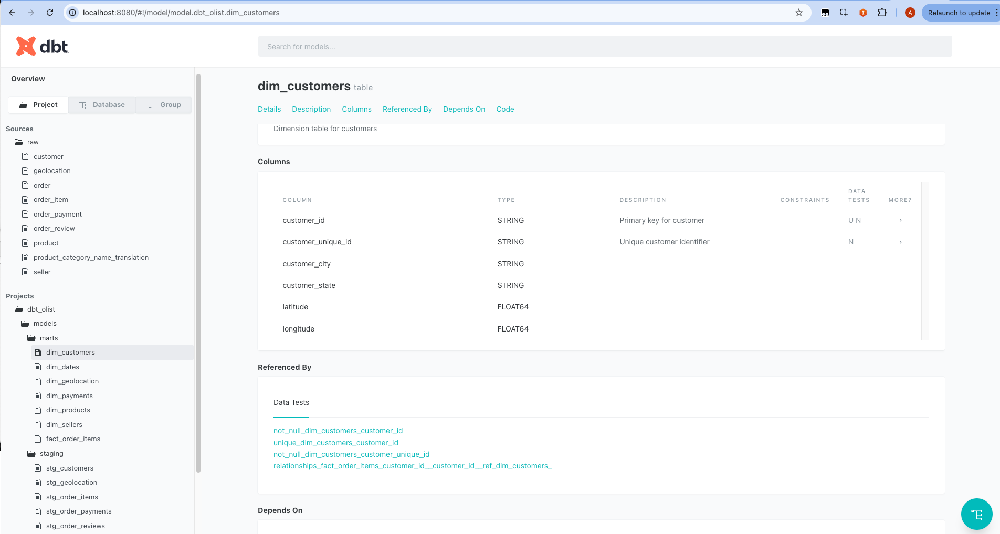

# Building dbt to Transform raw data into Data Warehouse

In this section, we will perform the following steps of the End-to-End ELT Pipeline.

**Step 3: Data Validation (The Quality Gate)**

- **Tool:** dbt
- **Action:** dbt staging model runs a series of data quality checks on the raw tables in the staging schema. It validates things like column data types, non-null constraints, and data formats to ensure the loaded data is reliable.
- **Output:** A validation report and, if a critical test fails, a signal to halt the pipeline before bad data can proceed.

**Step 4: Transformation (T - Transform)**

- **Tool:** dbt
- **Action:** Once the data passes dbt staging model validation, dbt reads from the clean staging tables. It then applies the transformation logic defined in its SQL models, which includes joining tables and applying business rules to create the final star schema.
- **Output:** The new, clean, and well-structured fact and dimension tables are written to a separate **production schema** in the data warehouse hosted in GCP Bigquery.

**Step 5: Data Quality Check**

- **Tool:** dbt
- **Action:** As part of the dbt test run, its built-in tests and additional tests from dbt_utils and dbt-expectations are executed on the newly created star schema tables. This step validates the transformation logic itself, checking for things like unique primary keys and foreign key relationships.
- **Output:** The star schema is confirmed to be correctly built and ready for use.

## 1. Init dbt Project

Set up a dbt project inside your current folder (5m-data-m2-project), with sources pointing at your raw CSVs under assets/, and models to build your star schema (fact + dimensions).

From inside 5m-data-m2-project, run:

dbt init dbt_olist

This creates a dbt_olist/ folder with starter configs.
Since you already have an assets/ folder with CSVs, we’ll configure dbt to treat them as seeds or sources.

## 2. Project Structure

We’ll use:
```
5m-data-m2-project/
├── assets/                       # your CSVs
├── dbt_olist/                    # new dbt project
│   ├── dbt_project.yml
│   ├── models/
│   │   ├── staging/
│   │   │   ├── stg_customers.sql
│   │   │   ├── stg_orders.sql
│   │   │   ├── stg_order_items.sql
│   │   │   ├── stg_order_payments.sql
│   │   │   ├── stg_products.sql
│   │   │   ├── stg_sellers.sql
│   │   │   ├── stg_order_reviews.sql
│   │   │   └── stg_geolocation.sql           # NEW
│   │   └── marts/
│   │       ├── dim_customers.sql
│   │       ├── dim_products.sql
│   │       ├── dim_sellers.sql
│   │       ├── dim_geolocation.sql           # NEW
│   │       ├── dim_dates.sql
│   │       ├── dim_payments.sql
│   │       └── fact_order_items.sql
│   └── seeds/
│       └── product_category_name_translation.csv
```

## 3. dbt_project.yml

Inside dbt_olist/dbt_project.yml:
```
name: 'dbt_olist'
version: '1.0.0'
profile: 'dbt_olist'

model-paths: ["models"]
seed-paths: ["seeds"]

models:
  dbt_olist:
    staging:
      materialized: view
    marts:
      materialized: table
```

Optional: To materialize dimensions as tables and fact as incremental (so you can rerun dbt without reloading the full dataset each time) That’s common in BigQuery setups to save cost.
```
name: 'dbt_olist'
version: '1.0.0'
profile: 'dbt_olist'

model-paths: ["models"]
seed-paths: ["seeds"]

models:
  dbt_olist:
    staging:
      materialized: view    # staging = lightweight views
    marts:
      dim_customers:
        materialized: table
      dim_products:
        materialized: table
      dim_sellers:
        materialized: table
      dim_geolocation:
        materialized: table
      dim_dates:
        materialized: table
      dim_payments:
        materialized: table
      fact_order_items:
        materialized: incremental
        incremental_strategy: merge
        unique_key: order_id
```

## 4. Profiles

Running with BigQuery, we’ll configure profiles.yml so that:

	•	Source schema = m2_ingestion (your Meltano-loaded raw CSVs).
    •	Target schema = m2_prod (your transformed star schema).

In ~/.dbt/profiles.yml, create a profile:
```
dbt_olist:
  target: dev
  outputs:
    dev:
      type: bigquery
      method: service-account  # or oauth if using gcloud auth
      project: sound-vehicle-468314-q4   # <-- your GCP project ID
      dataset: m2_prod                  # <-- dbt will build models here
      threads: 4
      timeout_seconds: 300
      location: US
      keyfile: /path/to/your/service_account.json  # if using service account
```

## 5. Sources

Create models/staging/sources.yml:
```
version: 2

sources:
  - name: raw
    schema: m2_ingestion     # raw staging area in BigQuery
    tables:
      - name: customer
      - name: order
      - name: order_item
      - name: order_payment
      - name: product
      - name: seller
      - name: order_review
      - name: geolocation   
```

## 6. Staging Models
Let’s build the full dbt SQL codebase based on the project structure:

	•	Sources → Staging → Dimensions & Fact
	•	Sources are your 7 CSV tables in m2_ingestion
	•	Targets are the star schema tables in m2_prod

### a. Staging Models

Each staging file just selects and cleans columns.

stg_customers.sql
```
{{ config(materialized='view') }}

select
    customer_id,
    customer_unique_id,
    customer_zip_code_prefix,
    customer_city,
    upper(customer_state) as customer_state,
    current_timestamp as record_loaded_at
from {{ source('raw', 'customer') }}
```

stg_orders.sql
```
{{ config(materialized='view') }}

select
    order_id,
    customer_id,
    lower(order_status) as order_status,
    safe_cast(nullif(order_purchase_timestamp, '') as timestamp) as order_purchase_timestamp,
    safe_cast(nullif(order_approved_at, '') as timestamp) as order_approved_at,
    safe_cast(nullif(order_delivered_carrier_date, '') as timestamp) as order_delivered_carrier_date,
    safe_cast(nullif(order_delivered_customer_date, '') as timestamp) as order_delivered_customer_date,
    safe_cast(nullif(order_estimated_delivery_date, '') as timestamp) as order_estimated_delivery_date,
    current_timestamp as record_loaded_at
from {{ source('raw', 'order') }}
```

stg_order_items.sql
```
{{ config(materialized='view') }}

select
    order_id,
    order_item_id,
    product_id,
    seller_id,
    safe_cast(shipping_limit_date as timestamp) as shipping_limit_timestamp,
    safe_cast(price as numeric) as price,
    safe_cast(freight_value as numeric) as freight_value,
    current_timestamp as record_loaded_at
from {{ source('raw', 'order_item') }}
```

stg_order_payments.sql
```
{{ config(materialized='view') }}

select
    order_id,
    payment_sequential,
    trim(lower(payment_type)) as payment_type,
    safe_cast(payment_installments as int) as payment_installments,
    safe_cast(payment_value as numeric) as payment_value
from {{ source('raw', 'order_payment') }}
```

stg_products.sql
```
{{ config(materialized='view') }}

select
    product_id,
    trim(product_category_name) as product_category_name,
    safe_cast(product_weight_g as numeric) as product_weight_g,
    safe_cast(product_length_cm as numeric) as product_length_cm,
    safe_cast(product_height_cm as numeric) as product_height_cm,
    safe_cast(product_width_cm as numeric) as product_width_cm,
    current_timestamp as record_loaded_at
from {{ source('raw', 'product') }} 
```

stg_sellers.sql
```
{{ config(materialized='view') }}

select
    seller_id,
    seller_zip_code_prefix,
    trim(lower(seller_city)) as seller_city,
    trim(upper(seller_state)) as seller_state,
    current_timestamp as record_loaded_at
```

stg_order_reviews.sql
```
{{ config(materialized='view') }}

select
    review_id,
    order_id,
    safe_cast(review_score as int) as review_score,
    safe_cast(review_creation_date as timestamp) as review_creation_date,
    safe_cast(review_answer_timestamp as timestamp) as review_answer_timestamp,
    current_timestamp as record_loaded_at  
from {{ source('raw', 'order_review') }}
```

stg_geolocation.sql
```
{{ config(materialized='view') }}

select
    geolocation_zip_code_prefix,
    avg(cast(geolocation_lat as float64)) as latitude,
    avg(cast(geolocation_lng as float64)) as longitude,
    trim(geolocation_city) as city,
    trim(upper(geolocation_state)) as state,
    current_timestamp as record_loaded_at
from {{ source('raw', 'geolocation') }}
group by
    geolocation_zip_code_prefix,
    city,
    state
```


stg_product_category_name_translation.sql
```
{{ config(materialized='view') }}

select
    trim(product_category_name) as product_category_name,
    trim(product_category_name_english) as product_category_name_english,
    current_timestamp as record_loaded_at
from {{ source('raw', 'product_category_name_translation') }}
```

### b. Dimension Models

dim_customers.sql
```
{{ config(materialized='table') }}

SELECT DISTINCT
    c.customer_id,
    c.customer_unique_id,
    c.customer_city,
    c.customer_state,
    g.geolocation_id,
    current_timestamp as record_loaded_at
FROM {{ ref('stg_customers') }} c
LEFT JOIN {{ ref('stg_geolocation') }} g
  ON c.customer_zip_code_prefix = g.geolocation_zip_code_prefix
```

dim_products.sql
```
{{ config(materialized='table') }}

SELECT
    p.product_id,
    coalesce(t. product_category_name_english, 'unknown') as product_category_name_english,
    p.product_weight_g,
    p.product_length_cm,
    p.product_height_cm,
    p.product_width_cm,
    current_timestamp as record_loaded_at
FROM {{ ref('stg_products') }} p
LEFT JOIN {{ ref('stg_product_category_name_translation') }} t
  ON p.product_category_name = t.product_category_name
```

dim_sellers.sql
```
{{ config(materialized='table') }}

SELECT DISTINCT
    s.seller_id,
    s.seller_city,
    s.seller_state,
    g.geolocation_id,
    current_timestamp as record_loaded_at
FROM {{ ref('stg_sellers') }} s
LEFT JOIN {{ ref('stg_geolocation') }} g
  ON s.seller_zip_code_prefix = g.geolocation_zip_code_prefix
```

dim_geolocation.sql
```
{{ config(materialized='table') }}

select
    {{ dbt_utils.generate_surrogate_key(['geolocation_zip_code_prefix']) }} as geolocation_id,
    geolocation_zip_code_prefix,
    avg(latitude) as latitude,          -- averages the already averaged values from stg_geolocation
    avg(longitude) as longitude,
    min(city) as city,                  -- pick one city deterministically
    min(state) as state,                -- pick one state deterministically
    current_timestamp as record_loaded_at
from {{ ref('stg_geolocation') }}
group by geolocation_zip_code_prefix
```

dim_dates.sql
```
{{ config(materialized='table') }}

with dates as (
    select distinct cast(order_purchase_timestamp as date) as full_date
    from {{ ref('stg_orders') }}
)
select
    cast(format_date('%Y%m%d', full_date) as int64) as date_key,
    full_date,
    format_date('%A', full_date) as day_of_week,
    format_date('%B', full_date) as month_name,
    extract(year from full_date) as year,
    extract(quarter from full_date) as quarter,
    current_timestamp as record_loaded_at
from dates
```

dim_payments.sql
```
{{ config(materialized='table') }}

select distinct
    {{ dbt_utils.generate_surrogate_key(['payment_type']) }} as payment_type_key,
    payment_type,
    case 
        when payment_type = 'credit_card' then 'Credit Card'
        when payment_type = 'debit_card' then 'Debit Card'
        when payment_type = 'boleto' then 'Boleto Bancário'
        when payment_type = 'voucher' then 'Voucher'
        when payment_type = 'not_defined' then 'Not Defined'
    end as payment_description,
    case 
        when payment_type in ('credit_card', 'debit_card') then 'Card Payment'
        when payment_type = 'boleto' then 'Bank Slip'
        when payment_type = 'voucher' then 'Prepaid Credit'
        when payment_type = 'not_defined' then 'Unknown'
    end as payment_category,
    current_timestamp() as loaded_at
from {{ ref('stg_order_payments') }}
where payment_type is not null
```

### c. Fact Model

fact_order_items.sql
```
{{ config(
    materialized='incremental',
    unique_key='order_item_id'
) }}

with order_payments as (
    select
        order_id,
        {{ dbt_utils.generate_surrogate_key(['payment_type']) }} as payment_type_key
    from (
        select
            order_id,
            lower(payment_type) as payment_type,
            row_number() over(
                partition by order_id 
                order by 
                    case payment_type                   -- Select a single, prioritized payment type for each order.
                        when 'credit_card' then 1       -- Highest Priority
                        when 'debit_card' then 2
                        when 'boleto' then 3
                        when 'voucher' then 4
                        else 5
                    end,
                    payment_type
            ) as rn
        from {{ ref('stg_order_payments') }}
        where payment_type is not null
    )
    where rn = 1
),

order_reviews as (
    select
        order_id,
        max(review_score) as review_score
    from {{ ref('stg_order_reviews') }}
    where review_score is not null
    group by order_id
),

base_data as (
    select
        oi.order_id,
        oi.order_item_id,
        oi.product_id,
        oi.seller_id,
        o.customer_id,
        cast(format_date('%Y%m%d', date(o.order_purchase_timestamp)) as int64) as order_date_key,
        coalesce(op.payment_type_key, '-1') as payment_type_key,
        oi.price,
        oi.freight_value,
        r.review_score,  
        date_diff(date(o.order_delivered_customer_date), date(o.order_purchase_timestamp), day) as delivery_time_days,
        o.order_purchase_timestamp
    from {{ ref('stg_order_items') }} oi
    inner join {{ ref('stg_orders') }} o
        on oi.order_id = o.order_id
    left join order_payments op
        on oi.order_id = op.order_id
    left join order_reviews r
        on oi.order_id = r.order_id
    where o.order_purchase_timestamp is not null

    
        -- Filters for new records since the last run
        and o.order_purchase_timestamp > (
            select coalesce(max(order_purchase_timestamp), timestamp('1900-01-01'))
            from {{ this }}
        )
    
),

final as (
    select
        order_id,
        order_item_id,
        product_id,
        seller_id,
        customer_id,
        order_date_key,
        payment_type_key,
        price,
        freight_value,
        review_score,
        delivery_time_days
    from (
        select
            *,
            row_number() over (
                partition by order_item_id 
                order by order_purchase_timestamp desc
            ) as rn
        from base_data
    )
    where rn = 1
)

select 
    *,
    current_timestamp as loaded_at
from final

```

### d. Seed

#### Why seeds exist in dbt
	•	Seeds are CSV files that dbt will load directly into your warehouse as tables.
	•	They are intended for small reference datasets that don’t change often, e.g.:
	•	Mapping tables
	•	Lookup tables
	•	Translation tables
	•	Unlike your raw datasets from Meltano (olist_customers_dataset.csv, etc.), seeds are not extracted from an external source at runtime. dbt just reads the CSV and loads it.

#### Why product_category_name_translation.csv is a seed
	•	In your schema, dim_products requires the English version of product_category_name:
```
left join {{ ref('product_category_name_translation') }} t
  on p.product_category_name = t.product_category_name
```
	•	This is not in your raw Olist CSVs — it’s an auxiliary reference file that maps Portuguese category names to English.
	•	Seeds are perfect here because:
	•	Small (71 rows)
	•	Static mapping
	•	Directly referenced by your dim_products transformation

#### Why other CSVs are not seeds
	•	Your main datasets (olist_customers_dataset.csv, olist_orders_dataset.csv, etc.) are raw transactional data.
	•	They are loaded via Meltano into m2_ingestion and are considered sources in dbt.
	•	dbt doesn’t load them itself — it transforms them once they’re in your warehouse.
	•	Making these seeds would:
	•	Force dbt to manage large CSVs every run (inefficient)
	•	Break incremental processing logic for fact_order_items

So basically: Seeds = static reference tables, Sources = dynamic raw data. That’s why only product_category_name_translation.csv is a seed.

Copy product_category_name_translation.csv into:
```
dbt_olist/seeds/product_category_name_translation.csv
```
Run it with:
```
dbt seed
```

### e. Workflow
i.	Test connection:
```
dbt debug
```

ii.	Load seed:
```
dbt seed
```

iii.	Build staging + marts:
```
dbt run
```

That’s the full dbt SQL codebase:
	•	Staging = views
	•	Dimensions = tables
	•	Fact = incremental fact table

## 7. dbt Tests 

As part of Data Quality Testing, we'll implement a comprehensive testing strategy across two layers. 

1. **Staging Layer** (`models/staging/stg_schema.yml`) → Enforce schema integrity and catch data quality issues early.
2. **Star Schema Layer** (`models/marts/star_schema.yml`) → Validate fact/dim relationships, primary key uniqueness, and referential integrity to fully document the star schema.

### Staging Layer Test Criteria:

- *Schema integrity*: Ensure correct column types (numeric/float vs. string)
- *Data hygiene*: Catch nulls, duplicates, and leading/trailing spaces early
- *Auditability*: Validate presence of `record_loaded_at` for lineage tracking
- *Lightweight checks*: Business rules deferred to fact/dim layers

### Star Schema Test Criteria:

- *Primary keys*: Validate uniqueness and non-null across all dimension + fact tables
- *Referential integrity*: Ensure fact tables correctly join to dimensions (e.g., `geolocation_id`, `payment_type_key`)
- *Dim consistency*: Verify surrogate key stability and null handling (e.g., “unknown” product category)
- *Business logic checks*: Confirm payment ranking logic and deduplication by timestamp, not just IDs

### Implementation Details:

a. **Geospatial Normalization**

- Removed lat/long from `dim_customers` and `dim_sellers`
- Centralized in `dim_geolocation` with surrogate key via `dbt_utils`
- Enforced one row per zip prefix with smoothed lat/long and deterministic city/state values

b. **Dimension Enrichment**

- `dim_payment`: Expanded `payment_type` → descriptive `payment_description` and `payment_category`
- `dim_products`: Replaced null product category names with `"unknown"`

c. **Fact Table Controls**

- Incremental loading via `` → only new records processed
- Stronger deduplication using `order_purchase_timestamp`
- Null filtering on payment types, review scores, and order timestamps
- Subqueries refactored into CTEs (`order_payments`, `order_reviews`)
- Added `loaded_at` for audit tracking

d. **Testing Outcomes**

- Staging views clean and standardize source CSVs from `m2_ingestion`
- Dimensions guarantee surrogate key uniqueness
- Facts handle missing values and avoid duplication
- Extended Data Quality with `dbt_expectations` to prevent drift from typos, unexpected nulls, or invalid values in categorical dimensions
- All dbt tests (core + expectations) pass: `not_null`, `unique`, `relationships`, `expect_column_values_to_be_in_set`
    
### models/staging/stg_schema.yml
```
version: 2

models:
  - name: stg_customers
    description: "Staging table for customers."
    columns:
      - name: customer_id
        tests:
          - not_null
          - unique
      - name: customer_unique_id
        tests:
          - not_null
      - name: customer_zip_code_prefix
        tests:
          - not_null

  - name: stg_geolocation
    description: "Staging table for geolocation data."
    columns:
      - name: geolocation_zip_code_prefix
        tests:
          - not_null

  - name: stg_order_items
    description: "Staging table for order items"
    columns:
      - name: order_id
        tests:
          - not_null
      - name: order_item_id
        tests:
          - not_null
      - name: product_id
        tests:
          - not_null
      - name: seller_id
        tests:
          - not_null
    tests:
      - dbt_utils.unique_combination_of_columns:
          combination_of_columns:
            - order_id
            - order_item_id

  - name: stg_order_payments
    description: "Staging table for order payments"
    tests:
      - dbt_utils.unique_combination_of_columns:
          combination_of_columns:
            - order_id
            - payment_sequential

  - name: stg_order_reviews
    description: "Staging table for order reviews."
    columns:
      - name: review_id
        tests:
          - not_null
      - name: order_id
        tests:
          - not_null
      - name: review_score
        tests:
          - not_null
          - dbt_expectations.expect_column_values_to_be_between:
              min_value: 1
              max_value: 5

  - name: stg_orders
    description: "Staging table for orders"
    columns:
      - name: order_id
        tests:
          - not_null
      - name: customer_id
        tests:
          - not_null
      - name: order_purchase_timestamp
        tests:
          - not_null
          - dbt_expectations.expect_column_values_to_be_of_type:
              column_type: timestamp

  - name: stg_products
    description: "Staging table for products."
    columns:
      - name: product_id
        tests:
          - not_null
          - unique

  - name: stg_sellers
    description: "Staging table for sellers."
    columns:
      - name: seller_id
        tests:
          - not_null
          - unique

```
### models/marts/schema.yml
```
version: 2
models:

  - name: fact_order_items
    description: "Central fact table containing order item transactions with foreign keys to dimension tables"
    columns:
      - name: order_item_id
        description: "Unique identifier for each order item (Primary Key)"
        tests:
          - unique
          - not_null
      - name: order_id
        description: "Foreign key to orders"
        tests:
          - not_null
      - name: product_id
        description: "Foreign key to dim_products"
        tests:
          - not_null
          - relationships:
              to: ref('dim_products')
              field: product_id
      - name: seller_id
        description: "Foreign key to dim_sellers"
        tests:
          - not_null
          - relationships:
              to: ref('dim_sellers')
              field: seller_id
      - name: customer_id
        description: "Foreign key to dim_customers"
        tests:
          - not_null
          - relationships:
              to: ref('dim_customers')
              field: customer_id
      - name: order_date_key
        description: "Foreign key to dim_orders (date dimension)"
        tests:
          - not_null
          - relationships:
              to: ref('dim_orders')
              field: date_key
      - name: payment_type_key
        description: "Foreign key to dim_payments (-1 for unknown)"
        tests:
          - not_null
          - relationships:
              to: ref('dim_payments')
              field: payment_type_key
      - name: price
        description: "Item price in local currency"
        tests:
          - not_null
          - dbt_expectations.expect_column_values_to_be_of_type:
              column_type: numeric
          - dbt_expectations.expect_column_values_to_be_between:
              min_value: 0
      - name: freight_value
        description: "Shipping cost for the item"
        tests:
          - dbt_expectations.expect_column_values_to_be_of_type:
              column_type: numeric
          - dbt_expectations.expect_column_values_to_be_between:
              min_value: 0
      - name: review_score
        description: "Customer review score (1-5)"
        tests:
          - dbt_expectations.expect_column_values_to_be_between:
              min_value: 1
              max_value: 5
      - name: delivery_time_days
        description: "Days between order purchase and delivery"
        tests:
          - dbt_expectations.expect_column_values_to_be_between:
              min_value: 0
              max_value: 365

  - name: dim_products
    description: "Product dimension containing product attributes"
    columns:
      - name: product_id
        description: "Unique product identifier (Primary Key)"
        tests:
          - unique
          - not_null

  - name: dim_customers
    description: "Customer dimension with geographic information"
    columns:
      - name: customer_id
        description: "Unique customer identifier (Primary Key)"
        tests:
          - unique
          - not_null
      - name: geolocation_id
        description: "Foreign key to dim_geolocation"
        tests:
          - relationships:
              to: ref('dim_geolocation')
              field: geolocation_id

  - name: dim_sellers
    description: "Seller dimension with geographic information"
    columns:
      - name: seller_id
        description: "Unique seller identifier (Primary Key)"
        tests:
          - unique
          - not_null
      - name: geolocation_id
        description: "Foreign key to dim_geolocation"
        tests:
          - relationships:
              to: ref('dim_geolocation')
              field: geolocation_id

  - name: dim_geolocation
    description: "Geographic dimension for customers and sellers"
    columns:
      - name: geolocation_id
        description: "Unique geographic location identifier (Primary Key)"
        tests:
          - unique
          - not_null
      - name: geolocation_zip_code_prefix
        description: "ZIP code prefix"
      - name: latitude
        tests:
          - dbt_expectations.expect_column_values_to_be_between:
              min_value: -90
              max_value: 90
      - name: longitude
        tests:
          - dbt_expectations.expect_column_values_to_be_between:
              min_value: -180
              max_value: 180

  - name: dim_dates
    description: "Date dimension for order analysis"
    columns:
      - name: date_key
        description: "Date key (Primary Key)"
        tests:
          - unique
          - not_null
      - name: day_of_week
        tests:
          - dbt_expectations.expect_column_values_to_be_in_set:
              value_set: ["Monday","Tuesday","Wednesday","Thursday","Friday","Saturday","Sunday"]
      - name: month_name
        tests:
          - dbt_expectations.expect_column_values_to_be_in_set:
              value_set: ["January","February","March","April","May","June","July","August","September","October","November","December"]

  - name: dim_payments
    description: "Payment type dimension"
    columns:
      - name: payment_type_key
        description: "Unique payment type key (Primary Key)"
        tests:
          - unique
          - not_null
      - name: payment_type
        tests:
          - dbt_expectations.expect_column_values_to_be_in_set:
              value_set: ["credit_card","debit_card","boleto","voucher","not_defined"]

```

### How to run dbt tests

After building models:
```
dbt test
```
This will validate:

	•	All primary key columns are unique and not null
	•	Other critical columns (customer_id, product_id, etc.) are not null


Result: You now have a fully validated star schema with:

	•	Staging models (stg_*)
	•	Dimension tables (dim_*)
	•	Incremental fact table (fact_order_items)
	•	dbt tests to catch schema or missing data issues

## 8. Documentation

1.	Foreign keys: Each column in fact_order_items references the corresponding primary key in the dimension table.
2.	dbt documentation: When you run:
```
dbt docs generate
dbt docs serve
```
You’ll see the full lineage graph showing all fact → dimension relationships.

3. Tests: dbt will also validate that the relationships exist, so missing dimension references are caught if you add relationships tests.

Result: Your project now has:

	•	Full star schema
	•	Primary key / uniqueness / not null tests
	•	Foreign key relationships for lineage and validation
	•	Incremental fact table to reduce cost on BigQuery
	•	If using BigQuery: You’ll first need to stage the CSVs into a dataset (raw) via Meltano or bq load.

## How it flows
	•	dbt will read from m2_ingestion.* (sources).
	•	dbt will write models into m2_prod.*.
	•	Your fact + dim tables will land in m2_prod dataset.

## 9. dbt Sequence Run
Here’s a ready-to-run dbt execution sequence for your BigQuery setup with seeds, staging, and incremental fact table. This ensures everything loads in the correct order and leverages incremental processing for the fact table.

### Step 1: Validate Connection
```
dbt debug
```

	•	Checks your profiles.yml for BigQuery credentials and connectivity.
	•	Make sure your target dataset (m2_prod) exists or dbt can create tables there.

### Step 2: Load Seeds
```
dbt seed
```

	•	Loads your product_category_name_translation.csv into BigQuery.
	•	Seed tables can be referenced in dim_products for English category names.

### Step 3: Build Staging Views
```
dbt run --select staging
```

	•	Builds all stg_* views in BigQuery.
	•	These are lightweight and ensure all raw data is cleaned/formatted for marts.

### Step 4: Build Dimensions
```
dbt run --select marts.dim_*
```

	•	Creates all dim_* tables (dim_customers, dim_products, dim_sellers, dim_dates, dim_payments) in m2_prod.
	•	Dimensions are fully rebuilt every run (small tables, inexpensive).

### Step 5: Build Incremental Fact Table
```
dbt run --select marts.fact_order_items
```

	•	Builds fact_order_items using incremental merge strategy.
	•	Only new or updated orders are appended.
	•	unique_key=order_id ensures deduplication.

### Step 6: Run Tests
```
dbt test
```

	•	Validates primary keys, not null columns, unique constraints, and foreign key relationships.
	•	Ensures integrity between fact and dimension tables.

### Step 7: Generate Documentation
```
dbt docs generate
dbt docs serve
```

	•	Opens a browser with full lineage and documentation for your star schema.
	•	Relationships between fact and dimensions are visible in the graph.



Notes / Best Practices

	•	Incremental fact table: you can rerun dbt run --select fact_order_items daily/weekly as new orders arrive without reprocessing the entire dataset.
	•	Dimension rebuild: cheap to fully refresh each run.
	•	Seeds: any reference tables (like product_category_name_translation) are loaded first.
	•	Testing: dbt test should be run after every full load or before production refresh.
