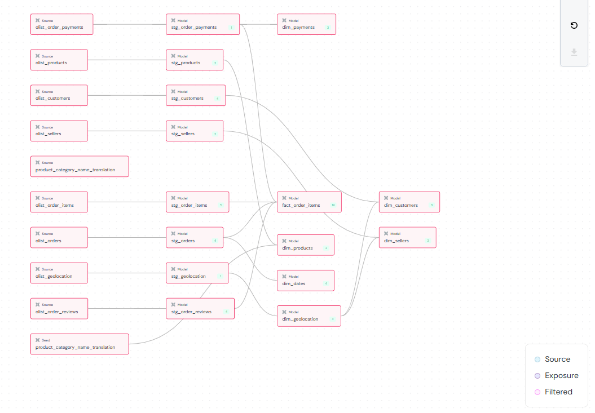

# Building dbt to Transform raw data into Data Warehouse

In this section, we will perform the following steps of the End-to-End ELT Pipeline.

**Step 3: Data Validation (The Quality Gate)**

- **Tool:** dbt
- **Action:** dbt staging model runs a series of data quality checks on the raw tables in the staging schema. It validates things like column data types, non-null constraints, and data formats to ensure the loaded data is reliable.
- **Output:** A validation report and, if a critical test fails, a signal to halt the pipeline before bad data can proceed.

**Step 4: Transformation (T - Transform)**

- **Tool:** dbt
- **Action:** Once the data passes dbt staging model validation, dbt reads from the clean staging tables. It then applies the transformation logic defined in its SQL models, which includes joining tables and applying business rules to create the final star schema.
- **Output:** The new, clean, and well-structured fact and dimension tables are written to a separate **production schema** in the data warehouse hosted in GCP Bigquery.

**Step 5: Data Quality Check**

- **Tool:** dbt
- **Action:** As part of the dbt test run, its built-in tests and additional tests from dbt_utils and dbt-expectations are executed on the newly created star schema tables. This step validates the transformation logic itself, checking for things like unique primary keys and foreign key relationships.
- **Output:** The star schema is confirmed to be correctly built and ready for use.

## 1. Init dbt Project

Set up a dbt project inside your current folder (5m-data-m2-project), with sources pointing at your raw CSVs under assets/, and models to build your star schema (fact + dimensions).

From inside 5m-data-m2-project, run:

dbt init dbt_olist

This creates a dbt_olist/ folder with starter configs.
Since you already have an assets/ folder with CSVs, we’ll configure dbt to treat them as seeds or sources.

## 2. Project Structure

We’ll use:
```
5m-data-m2-project/
├── assets/                       # your CSVs
├── dbt_olist/                    # new dbt project
│   ├── dbt_project.yml
│   ├── packages.yml
│   ├── models/
│   │   ├── staging/
│   │   │   ├── stg_customers.sql
│   │   │   ├── stg_orders.sql
│   │   │   ├── stg_order_items.sql
│   │   │   ├── stg_order_payments.sql
│   │   │   ├── stg_products.sql
│   │   │   ├── stg_sellers.sql
│   │   │   ├── stg_order_reviews.sql
│   │   │   └── stg_geolocation.sql           # NEW
│   │   └── marts/
│   │       ├── dim_customers.sql
│   │       ├── dim_products.sql
│   │       ├── dim_sellers.sql
│   │       ├── dim_geolocation.sql           # NEW
│   │       ├── dim_dates.sql
│   │       ├── dim_payments.sql
│   │       └── fact_order_items.sql
│   └── seeds/
│       └── product_category_name_translation.csv
```

## 3. dbt_project.yml & packages.yml

Inside dbt_olist/dbt_project.yml:
```
name: 'dbt_olist'
version: '1.0.0'
profile: 'dbt_olist'

model-paths: ["models"]
seed-paths: ["seeds"]

models:
  dbt_olist:
    staging:
      materialized: view
    marts:
      materialized: table
```

Optional: To materialize dimensions as tables and fact as incremental (so you can rerun dbt without reloading the full dataset each time) That’s common in BigQuery setups to save cost.
```
name: 'dbt_olist'
version: '1.0.0'
profile: 'dbt_olist'

model-paths: ["models"]
seed-paths: ["seeds"]

models:
  dbt_olist:
    staging:
      materialized: view    # staging = lightweight views
    marts:
      dim_customers:
        materialized: table
      dim_products:
        materialized: table
      dim_sellers:
        materialized: table
      dim_geolocation:
        materialized: table
      dim_dates:
        materialized: table
      dim_payments:
        materialized: table
      fact_order_items:
        materialized: incremental
        incremental_strategy: merge
        unique_key: order_id

    elementary:
      ## elementary models will be created in the schema '<your_schema>_elementary'
      +schema: "elementary"
```

- Create a new file: `packages.yml` and include the following packages required for running the dbt tests:
```
packages:
  - package: dbt-labs/dbt_utils
    version: 1.3.0
  - package: metaplane/dbt_expectations
    version: 0.10.9
  - package: godatadriven/dbt_date
    version: 0.15.0
  - package: elementary-data/elementary
    version: 0.19.4
```

## 4. Profiles

Running with BigQuery, we’ll configure profiles.yml so that:

	- Source schema = m2_ingestion (your Meltano-loaded raw CSVs).
    - Target schema = m2_prod (your transformed star schema).
    - Monitoring layer = m2_prod_elementary (for analysis of model performance, tests, freshness, and data quality.)

In ~/.dbt/profiles.yml, create a profile:
```
dbt_olist:
  target: dev
  outputs:
    dev:
      type: bigquery
      method: service-account  # or oauth if using gcloud auth
      project: sound-vehicle-468314-q4   # <-- your GCP project ID
      dataset: m2_prod                  # <-- dbt will build models here
      threads: 4
      timeout_seconds: 300
      location: US
      keyfile: /path/to/your/service_account.json  # if using service account

elementary:
  outputs:
    dev:
      dataset: m2_prod_elementary # serve as monitoring layer to analyse dbt model performance 
      job_retries: 1
      location: US
      method: service-account
      keyfile: /path/to/your/service_account.json  # if using service account
      priority: interactive
      project: sound-vehicle-468314-q4   # <-- your GCP project ID
      threads: 4
      type: bigquery
  target: dev
```

## 5. Sources

Create models/staging/sources.yml:
```
version: 2

sources:
  - name: raw
    schema: m2_ingestion     # raw staging area in BigQuery
    tables:
      - name: customer
      - name: order
      - name: order_item
      - name: order_payment
      - name: product
      - name: seller
      - name: order_review
      - name: geolocation   
```

## 6. Staging Models
Let’s build the full dbt SQL codebase based on the project structure:

	- Sources → Staging → Dimensions & Fact
	- Sources are your 7 CSV tables in m2_ingestion
	- Targets are the star schema tables in m2_prod

### a. Staging Models

Each staging file just selects and cleans columns.

- [stg_customers.sql](./dbt_olist/models/staging/stg_customers.sql)
- [stg_geolocation.sql](./dbt_olist/models/staging/stg_geolocation.sql)
- [stg_order_items.sql](./dbt_olist/models/staging/stg_order_items.sql)
- [stg_order_reviews.sql](./dbt_olist/models/staging/stg_order_reviews.sql)
- [stg_order_payments.sql](./dbt_olist/models/staging/stg_order_payments.sql)
- [stg_products.sql](./dbt_olist/models/staging/stg_products.sql)
- [stg_orders.sql](./dbt_olist/models/staging/stg_orders.sql)
- [stg_sellers.sql](./dbt_olist/models/staging/stg_sellers.sql)
- [stg_product_category_name_translation.sql](./dbt_olist/models/staging/stg_product_category_name_translation.sql)


### b. Dimension Models

- [dim_customers.sql](./dbt_olist/models/marts/dim_customers.sql)
- [dim_dates.sql](./dbt_olist/models/marts/dim_dates.sql)
- [dim_geolocation.sql](./dbt_olist/models/marts/dim_geolocation.sql)
- [dim_payments.sql](./dbt_olist/models/marts/dim_payments.sql)
- [dim_sellers.sql](./dbt_olist/models/marts/dim_sellers.sql)

### c. Fact Model

- [fact_order_items.sql](./dbt_olist/models/marts/fact_order_items.sql)

### d. Seed

#### Why seeds exist in dbt
	- Seeds are CSV files that dbt will load directly into your warehouse as tables.
	- They are intended for small reference datasets that don’t change often, e.g.:
	- Mapping tables
	- Lookup tables
	- Translation tables
	- Unlike your raw datasets from Meltano (olist_customers_dataset.csv, etc.), seeds are not extracted from an external source at runtime. dbt just reads the CSV and loads it.

#### Why product_category_name_translation.csv is a seed
	- In your schema, dim_products requires the English version of product_category_name:
```
left join {{ ref('product_category_name_translation') }} t
  on p.product_category_name = t.product_category_name
```
	- This is not in your raw Olist CSVs — it’s an auxiliary reference file that maps Portuguese category names to English.
	- Seeds are perfect here because:
	- Small (71 rows)
	- Static mapping
	- Directly referenced by your dim_products transformation

#### Why other CSVs are not seeds
	- Your main datasets (olist_customers_dataset.csv, olist_orders_dataset.csv, etc.) are raw transactional data.
	- They are loaded via Meltano into m2_ingestion and are considered sources in dbt.
	- dbt doesn’t load them itself — it transforms them once they’re in your warehouse.
	- Making these seeds would:
	- Force dbt to manage large CSVs every run (inefficient)
	- Break incremental processing logic for fact_order_items

So basically: Seeds = static reference tables, Sources = dynamic raw data. That’s why only product_category_name_translation.csv is a seed.

Copy product_category_name_translation.csv into:
```
dbt_olist/seeds/product_category_name_translation.csv
```
Run it with:
```
dbt seed
```

### e. Workflow
i.	Test connection:
```
dbt debug
```

ii. Load the packages
```
dbt deps
```

iii.	Load seed:
```
dbt seed
```

iv.	Build staging + marts:
```
dbt run
```

That’s the full dbt SQL codebase:
	- Staging = views
	- Dimensions = tables
	- Fact = incremental fact table

## 7. dbt Tests 

As part of Data Quality Testing, let’s add dbt tests for the star schema. We’ll create a schema.yml file in the models/marts/ folder that validates primary keys, non-null columns, and optionally unique constraints. We'll to include relationships/foreign keys so dbt can build lineage and document your star schema fully.

### Tests Criteria:

a. Latitude/longitude now available in dim_customers, dim_sellers, and separately in dim_geolocation for geospatial analytics.

b. Geolocation enrichment standardizes city/state values in customer and seller dimensions via zip prefix; primary keys and column names remain unchanged. `geolocation_zip_code_prefix` is always referenced as a string and not null.

c. Sources are all raw Meltano-loaded CSVs in m2_ingestion.


- Staging model tests mainly enforce uniqueness and not-null constraints on unique keys for each staging table, along with composite key checks and basic validations (timestamps, review scores).

  [stg_schema.yml](./dbt_olist/models/staging/stg_schema.yml)

- Star schema model tests include fact and dimension tables to ensure uniqueness, not-null integrity, valid foreign key relationships, correct data types, and expected value ranges/sets. They cover key checks for primary keys, referential integrity, numeric bounds, and categorical consistency to maintain reliable analytics.

  [schema.yml](./dbt_olist/models/marts/schema.yml)

### How to run dbt tests

After building models:
```
dbt test
```
This will validate:

	- All primary key columns are unique and not null
	- Other critical columns (customer_id, product_id, etc.) are not null


Result: You now have a fully validated star schema with:

	- Staging models (stg_*)
	- Dimension tables (dim_*)
	- Incremental fact table (fact_order_items)
	- dbt tests to catch schema or missing data issues

## 8. Documentation

1.	Foreign keys: Each column in fact_order_items references the corresponding primary key in the dimension table.
2.	dbt documentation: When you run:
```
dbt docs generate
dbt docs serve
```
You’ll see the full lineage graph showing all fact → dimension relationships.

3. Tests: dbt will also validate that the relationships exist, so missing dimension references are caught if you add relationships tests.

Alternatively, you can also run the following to see the elementary dashboard:
```
edr report
```

Result: Your project now has:

	- Full star schema
	- Primary key / uniqueness / not null tests
	- Foreign key relationships for lineage and validation
	- Incremental fact table to reduce cost on BigQuery
	- If using BigQuery: You’ll first need to stage the CSVs into a dataset (raw) via Meltano or bq load.

## How it flows
	- dbt will read from m2_ingestion.* (sources).
	- dbt will write models into m2_prod.*.
	- Your fact + dim tables will land in m2_prod dataset.

## 9. dbt Sequence Run
Here’s a ready-to-run dbt execution sequence for your BigQuery setup with seeds, staging, and incremental fact table. This ensures everything loads in the correct order and leverages incremental processing for the fact table.

### Step 1: Validate Connection
```
dbt debug
```

	- Checks your profiles.yml for BigQuery credentials and connectivity.
	- Make sure your target dataset (m2_prod) exists or dbt can create tables there.

### Step 2: Install dbt packages
```
dbt deps
```

  - Install the relevant dbt packages (dbt utils, dbt-expectations, elementary for the dbt tests)

### Step 3: Load Seeds
```
dbt seed
```

	- Loads your product_category_name_translation.csv into BigQuery.
	- Seed tables can be referenced in dim_products for English category names.

### Step 4: Build Staging Views
```
dbt run --select staging
```

	- Builds all stg_* views in BigQuery.
	- These are lightweight and ensure all raw data is cleaned/formatted for marts.

### Step 5: Build Dimensions
```
dbt run --select marts.dim_*
```

	- Creates all dim_* tables (dim_customers, dim_products, dim_sellers, dim_dates, dim_payments) in m2_prod.
	- Dimensions are fully rebuilt every run (small tables, inexpensive).

### Step 6: Build Incremental Fact Table
```
dbt run --select marts.fact_order_items
```

	- Builds fact_order_items using incremental merge strategy.
	- Only new or updated orders are appended.
	- unique_key=order_id ensures deduplication.

### Step 7: Run Tests
```
dbt test
```

	- Validates primary keys, not null columns, unique constraints, and foreign key relationships.
	- Ensures integrity between fact and dimension tables.

## Using Elementary Dashboard to View Test Results
```
edr report
```
You can see the dashbord showing the overview of the dbt tests performed.


You can also observe the data lineage:


Details on the dbt tests performed:


Notes / Best Practices

	- Incremental fact table: you can rerun dbt run --select fact_order_items daily/weekly as new orders arrive without reprocessing the entire dataset.
	- Dimension rebuild: cheap to fully refresh each run.
	- Seeds: any reference tables (like product_category_name_translation) are loaded first.
	- Testing: dbt test should be run after every full load or before production refresh.

### Step 8: Generate Documentation
```
dbt docs generate
dbt docs serve
```

	- Opens a browser with full lineage and documentation for your star schema.
	- Relationships between fact and dimensions are visible in the graph.


## Re-generate ERD from the dbt docs

This step allows you to regenerate the production ERD from the dbt documentation. This will allow ongoing updates of any DB schema changes.

```
pip install dbterd
dbt docs generate   <-- if not already run with latest changes
dbterd run    <-- this will generate dbt_project_folder/target/output.dbml
Copy the contents of output.dbml and paste into dbdiagram.io
It will render an interactive ERD diagram.
```

Updated ERD for DB Star-Schema:
