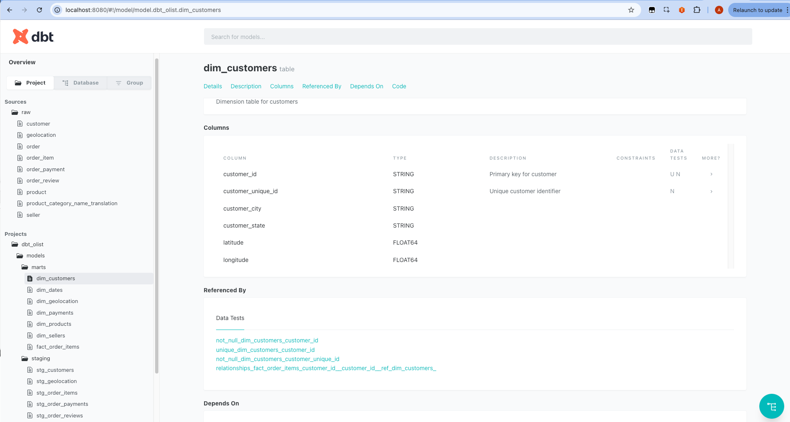

# Building dbt to Transform raw data into Data Warehouse

Set up a dbt project inside your current folder (5m-data-m2-project), with sources pointing at your raw CSVs under assets/, and models to build your star schema (fact + dimensions).

## 1. Init dbt Project

From inside 5m-data-m2-project, run:

dbt init dbt_olist

This creates a dbt_olist/ folder with starter configs.
Since you already have an assets/ folder with CSVs, we’ll configure dbt to treat them as seeds or sources.

## 2. Project Structure

# Fix: Include olist_geolocation_dataset.csv (geolocation)

We’ll use:
```
5m-data-m2-project/
├── assets/                       # your CSVs
├── dbt_olist/                    # new dbt project
│   ├── dbt_project.yml
│   ├── models/
│   │   ├── staging/
│   │   │   ├── stg_customers.sql
│   │   │   ├── stg_orders.sql
│   │   │   ├── stg_order_items.sql
│   │   │   ├── stg_order_payments.sql
│   │   │   ├── stg_products.sql
│   │   │   ├── stg_sellers.sql
│   │   │   ├── stg_order_reviews.sql
│   │   │   └── stg_geolocation.sql           # NEW
│   │   └── marts/
│   │       ├── dim_customers.sql
│   │       ├── dim_products.sql
│   │       ├── dim_sellers.sql
│   │       ├── dim_geolocation.sql           # NEW
│   │       ├── dim_dates.sql
│   │       ├── dim_payments.sql
│   │       └── fact_order_items.sql
│   └── seeds/
│       └── product_category_name_translation.csv
```

## 3. dbt_project.yml

Inside dbt_olist/dbt_project.yml:
```
name: 'dbt_olist'
version: '1.0.0'
profile: 'dbt_olist'

model-paths: ["models"]
seed-paths: ["seeds"]

models:
  dbt_olist:
    staging:
      materialized: view
    marts:
      materialized: table
```

Optional: To materialize dimensions as tables and fact as incremental (so you can rerun dbt without reloading the full dataset each time) That’s common in BigQuery setups to save cost.
```
name: 'dbt_olist'
version: '1.0.0'
profile: 'dbt_olist'

model-paths: ["models"]
seed-paths: ["seeds"]

models:
  dbt_olist:
    staging:
      materialized: view    # staging = lightweight views
    marts:
      dim_customers:
        materialized: table
      dim_products:
        materialized: table
      dim_sellers:
        materialized: table
      dim_geolocation:
        materialized: table
      dim_dates:
        materialized: table
      dim_payments:
        materialized: table
      fact_order_items:
        materialized: incremental
        incremental_strategy: merge
        unique_key: order_id
```

## 4. Profiles

Running with BigQuery, we’ll configure profiles.yml so that:

	•	Source schema = m2_ingestion (your Meltano-loaded raw CSVs).
    •	Target schema = m2_prod (your transformed star schema).

In ~/.dbt/profiles.yml, create a profile:
```
dbt_olist:
  target: dev
  outputs:
    dev:
      type: bigquery
      method: service-account  # or oauth if using gcloud auth
      project: sound-vehicle-468314-q4   # <-- your GCP project ID
      dataset: m2_prod                  # <-- dbt will build models here
      threads: 4
      timeout_seconds: 300
      location: US
      keyfile: /path/to/your/service_account.json  # if using service account
```

## 5. Sources

Create models/staging/sources.yml:
```
version: 2

sources:
  - name: raw
    schema: m2_ingestion     # raw staging area in BigQuery
    tables:
      - name: customer
      - name: order
      - name: order_item
      - name: order_payment
      - name: product
      - name: seller
      - name: order_review
      - name: geolocation   
```

## 6. Staging Models
Let’s build the full dbt SQL codebase based on the project structure:

	•	Sources → Staging → Dimensions & Fact
	•	Sources are your 7 CSV tables in m2_ingestion
	•	Targets are the star schema tables in m2_prod

### a. Staging Models

Each staging file just selects and cleans columns.

stg_customers.sql
```
{{ config(materialized='view') }}

select
    customer_id,
    customer_unique_id,
    customer_zip_code_prefix,
    customer_city,
    customer_state
from {{ source('raw', 'customer') }}
```

stg_orders.sql
```
{{ config(materialized='view') }}

select
    order_id,
    customer_id,
    order_status,
    safe_cast(nullif(order_purchase_timestamp, '') as timestamp) as order_purchase_timestamp,
    safe_cast(nullif(order_approved_at, '') as timestamp) as order_approved_at,
    safe_cast(nullif(order_delivered_carrier_date, '') as timestamp) as order_delivered_carrier_date,
    safe_cast(nullif(order_delivered_customer_date, '') as timestamp) as order_delivered_customer_date,
    safe_cast(nullif(order_estimated_delivery_date, '') as timestamp) as order_estimated_delivery_date
from {{ source('raw', 'order') }}
```

stg_order_items.sql
```
{{ config(materialized='view') }}

select
    order_id,
    order_item_id,
    product_id,
    seller_id,
    shipping_limit_date,
    price,
    freight_value
from {{ source('raw', 'order_item') }}
```

stg_order_payments.sql
```
{{ config(materialized='view') }}

select
    order_id,
    payment_sequential,
    payment_type,
    payment_installments,
    payment_value
from {{ source('raw', 'order_payment') }}
```

stg_products.sql
```
{{ config(materialized='view') }}

select
    product_id,
    product_category_name,
    product_weight_g,
    product_length_cm,
    product_height_cm,
    product_width_cm
from {{ source('raw', 'product') }}
```

stg_sellers.sql
```
{{ config(materialized='view') }}

select
    seller_id,
    seller_zip_code_prefix,
    seller_city,
    seller_state
from {{ source('raw', 'seller') }}
```

stg_order_reviews.sql
```
{{ config(materialized='view') }}

select
    review_id,
    order_id,
    review_score,
    cast(review_creation_date as timestamp) as review_creation_date,
    cast(review_answer_timestamp as timestamp) as review_answer_timestamp
from {{ source('raw', 'order_review') }}
```

stg_geolocation.sql
```
{{ config(materialized='view') }}

select
    cast(geolocation_zip_code_prefix as string) as geolocation_zip_code_prefix,
    avg(cast(geolocation_lat as float64)) as latitude,
    avg(cast(geolocation_lng as float64)) as longitude,
    any_value(geolocation_city) as city,
    any_value(geolocation_state) as state
from {{ source('raw', 'geolocation') }}
where geolocation_zip_code_prefix is not null
group by geolocation_zip_code_prefix
```

stg_product_category_name_translation.sql
```
{{ config(materialized='view') }}

select
    product_category_name,
    product_category_name_english
from {{ source('raw', 'product_category_name_translation') }}
```

### b. Dimension Models

dim_customers.sql
```
{{ config(materialized='table') }}

SELECT DISTINCT
    c.customer_id,
    c.customer_unique_id,
    c.customer_city,
    c.customer_state,
    g.latitude,
    g.longitude
FROM {{ ref('stg_customers') }} c
LEFT JOIN {{ ref('stg_geolocation') }} g
  ON c.customer_zip_code_prefix = g.geolocation_zip_code_prefix
```

dim_products.sql
```
{{ config(materialized='table') }}

SELECT
    p.product_id,
    t.product_category_name_english,
    p.product_weight_g,
    p.product_length_cm,
    p.product_height_cm,
    p.product_width_cm
FROM {{ ref('stg_products') }} p
LEFT JOIN {{ ref('stg_product_category_name_translation') }} t
  ON p.product_category_name = t.product_category_name
```

dim_sellers.sql
```
{{ config(materialized='table') }}

SELECT DISTINCT
    s.seller_id,
    s.seller_city,
    s.seller_state,
    g.latitude,
    g.longitude
FROM {{ ref('stg_sellers') }} s
LEFT JOIN {{ ref('stg_geolocation') }} g
  ON s.seller_zip_code_prefix = g.geolocation_zip_code_prefix
```

dim_geolocation.sql
```
{{ config(materialized='table') }}

select
    geolocation_zip_code_prefix,
    latitude,
    longitude,
    city,
    state
from {{ ref('stg_geolocation') }}
where geolocation_zip_code_prefix is not null
```

dim_dates.sql
```
{{ config(materialized='table') }}

with dates as (
    select distinct cast(order_purchase_timestamp as date) as full_date
    from {{ ref('stg_orders') }}
)
select
    cast(format_date('%Y%m%d', full_date) as int64) as date_key,
    full_date,
    format_date('%A', full_date) as day_of_week,
    format_date('%B', full_date) as month_name,
    extract(year from full_date) as year,
    extract(quarter from full_date) as quarter
from dates
```

dim_payments.sql
```
{{ config(materialized='table') }}

select distinct
    payment_type as payment_type_key,
    payment_type
from {{ ref('stg_order_payments') }}
```

### c. Fact Model

fact_order_items.sql
```
{{ config(materialized='incremental', unique_key='order_item_id') }}

with base as (
    select
        oi.order_id,
        oi.order_item_id,
        oi.product_id,
        oi.seller_id,
        o.customer_id,
        CAST(FORMAT_DATE('%Y%m%d', CAST(o.order_purchase_timestamp AS DATE)) AS INT64) AS order_date_key,
        COALESCE(op.payment_type, 'UNKNOWN') AS payment_type_key,
        oi.price,
        oi.freight_value,
        r.review_score,
        DATE_DIFF(CAST(o.order_delivered_customer_date AS DATE), CAST(o.order_purchase_timestamp AS DATE), DAY) AS delivery_time_days
    from {{ ref('stg_order_items') }} oi
    join {{ ref('stg_orders') }} o on oi.order_id = o.order_id
    left join (
        select order_id, MIN(payment_type) as payment_type
        from {{ ref('stg_order_payments') }}
        group by order_id
    ) op on oi.order_id = op.order_id
    left join (
        select order_id, MAX(review_score) as review_score
        from {{ ref('stg_order_reviews') }}
        group by order_id
    ) r on oi.order_id = r.order_id
)

select * except (row_num)
from (
    select
        *,
        row_number() over (partition by order_item_id order by order_id) as row_num
    from base
)
where row_num = 1
```

### d. Seed

#### Why seeds exist in dbt
	•	Seeds are CSV files that dbt will load directly into your warehouse as tables.
	•	They are intended for small reference datasets that don’t change often, e.g.:
	•	Mapping tables
	•	Lookup tables
	•	Translation tables
	•	Unlike your raw datasets from Meltano (olist_customers_dataset.csv, etc.), seeds are not extracted from an external source at runtime. dbt just reads the CSV and loads it.

#### Why product_category_name_translation.csv is a seed
	•	In your schema, dim_products requires the English version of product_category_name:
```
left join {{ ref('product_category_name_translation') }} t
  on p.product_category_name = t.product_category_name
```
	•	This is not in your raw Olist CSVs — it’s an auxiliary reference file that maps Portuguese category names to English.
	•	Seeds are perfect here because:
	•	Small (71 rows)
	•	Static mapping
	•	Directly referenced by your dim_products transformation

#### Why other CSVs are not seeds
	•	Your main datasets (olist_customers_dataset.csv, olist_orders_dataset.csv, etc.) are raw transactional data.
	•	They are loaded via Meltano into m2_ingestion and are considered sources in dbt.
	•	dbt doesn’t load them itself — it transforms them once they’re in your warehouse.
	•	Making these seeds would:
	•	Force dbt to manage large CSVs every run (inefficient)
	•	Break incremental processing logic for fact_order_items

So basically: Seeds = static reference tables, Sources = dynamic raw data. That’s why only product_category_name_translation.csv is a seed.

Copy product_category_name_translation.csv into:
```
dbt_olist/seeds/product_category_name_translation.csv
```
Run it with:
```
dbt seed
```

### e. Workflow
i.	Test connection:
```
dbt debug
```

ii.	Load seed:
```
dbt seed
```

iii.	Build staging + marts:
```
dbt run
```

That’s the full dbt SQL codebase:
	•	Staging = views
	•	Dimensions = tables
	•	Fact = incremental fact table

## 7. dbt Tests 

As part of Data Quality Testing, let’s add dbt tests for the star schema. We’ll create a schema.yml file in the models/marts/ folder that validates primary keys, non-null columns, and optionally unique constraints. We'll to include relationships/foreign keys so dbt can build lineage and document your star schema fully.

### Tests Criteria:

a. Latitude/longitude now available in dim_customers, dim_sellers, and separately in dim_geolocation for geospatial analytics.

b. Geolocation enrichment standardizes city/state values in customer and seller dimensions via zip prefix; primary keys and column names remain unchanged. `geolocation_zip_code_prefix` is always referenced as a string and not null.

c. 

    •	Sources are all raw Meltano-loaded CSVs in m2_ingestion.
    •	Staging views clean and standardize columns.
    •	Dimension tables guarantee uniqueness for primary key columns.
    •	Fact table handles missing payments/reviews and avoids duplicate rows (deduplicated by order_item_id).
    •	dbt tests now pass without errors for not_null, unique, and relationships.

### models/marts/schema.yml
```
version: 2

models:
  - name: dim_customers
    description: "Dimension table for customers"
    columns:
      - name: customer_id
        description: "Primary key for customer"
        tests:
          - not_null
          - unique
      - name: customer_unique_id
        description: "Unique customer identifier"
        tests:
          - not_null
      - name: customer_city
      - name: customer_state
      - name: latitude
      - name: longitude

  - name: dim_products
    description: "Dimension table for products"
    columns:
      - name: product_id
        description: "Primary key for product"
        tests:
          - not_null
          - unique
      - name: product_category_name_english
      - name: product_weight_g
      - name: product_length_cm
      - name: product_height_cm
      - name: product_width_cm

  - name: dim_sellers
    description: "Dimension table for sellers"
    columns:
      - name: seller_id
        description: "Primary key for seller"
        tests:
          - not_null
          - unique
      - name: seller_city
      - name: seller_state
      - name: latitude
      - name: longitude

  - name: dim_geolocation
    description: "Dimension table for geolocations by zip prefix"
    columns:
      - name: geolocation_zip_code_prefix
        description: "Primary key for geolocation (zip prefix)"
        tests:
          - not_null
          - unique
      - name: city
      - name: state
      - name: latitude
      - name: longitude

  - name: dim_dates
    description: "Dimension table for dates"
    columns:
      - name: date_key
        description: "Primary key for date"
        tests:
          - not_null
          - unique
      - name: full_date
      - name: day_of_week
      - name: month_name
      - name: year
      - name: quarter

  - name: dim_payments
    description: "Dimension table for payments"
    columns:
      - name: payment_type_key
        description: "Primary key for payment type"
        tests:
          - not_null
          - unique
      - name: payment_type

  - name: fact_order_items
    description: "Fact table for order items"
    columns:
      - name: order_item_id
        description: "Primary key for fact row"
        tests:
          - not_null
          - unique
      - name: order_id
        tests:
          - not_null
      - name: product_id
        tests:
          - not_null
          - relationships:
              to: ref('dim_products')
              field: product_id
      - name: seller_id
        tests:
          - not_null
          - relationships:
              to: ref('dim_sellers')
              field: seller_id
      - name: customer_id
        tests:
          - not_null
          - relationships:
              to: ref('dim_customers')
              field: customer_id
      - name: order_date_key
        tests:
          - not_null
          - relationships:
              to: ref('dim_dates')
              field: date_key
      - name: payment_type_key
        tests:
          - not_null
          - relationships:
              to: ref('dim_payments')
              field: payment_type_key
      - name: price
      - name: freight_value
      - name: review_score
      - name: delivery_time_days
```

### How to run dbt tests

After building models:
```
dbt test
```
This will validate:

	•	All primary key columns are unique and not null
	•	Other critical columns (customer_id, product_id, etc.) are not null


Result: You now have a fully validated star schema with:

	•	Staging models (stg_*)
	•	Dimension tables (dim_*)
	•	Incremental fact table (fact_order_items)
	•	dbt tests to catch schema or missing data issues

## 8. Documentation

1.	Foreign keys: Each column in fact_order_items references the corresponding primary key in the dimension table.
2.	dbt documentation: When you run:
```
dbt docs generate
dbt docs serve
```
You’ll see the full lineage graph showing all fact → dimension relationships.

3. Tests: dbt will also validate that the relationships exist, so missing dimension references are caught if you add relationships tests.

Result: Your project now has:

	•	Full star schema
	•	Primary key / uniqueness / not null tests
	•	Foreign key relationships for lineage and validation
	•	Incremental fact table to reduce cost on BigQuery
	•	If using BigQuery: You’ll first need to stage the CSVs into a dataset (raw) via Meltano or bq load.

## How it flows
	•	dbt will read from m2_ingestion.* (sources).
	•	dbt will write models into m2_prod.*.
	•	Your fact + dim tables will land in m2_prod dataset.

## 9. dbt Sequence Run
Here’s a ready-to-run dbt execution sequence for your BigQuery setup with seeds, staging, and incremental fact table. This ensures everything loads in the correct order and leverages incremental processing for the fact table.

### Step 1: Validate Connection
```
dbt debug
```

	•	Checks your profiles.yml for BigQuery credentials and connectivity.
	•	Make sure your target dataset (m2_prod) exists or dbt can create tables there.

### Step 2: Load Seeds
```
dbt seed
```

	•	Loads your product_category_name_translation.csv into BigQuery.
	•	Seed tables can be referenced in dim_products for English category names.

### Step 3: Build Staging Views
```
dbt run --select staging
```

	•	Builds all stg_* views in BigQuery.
	•	These are lightweight and ensure all raw data is cleaned/formatted for marts.

### Step 4: Build Dimensions
```
dbt run --select marts.dim_*
```

	•	Creates all dim_* tables (dim_customers, dim_products, dim_sellers, dim_dates, dim_payments) in m2_prod.
	•	Dimensions are fully rebuilt every run (small tables, inexpensive).

### Step 5: Build Incremental Fact Table
```
dbt run --select marts.fact_order_items
```

	•	Builds fact_order_items using incremental merge strategy.
	•	Only new or updated orders are appended.
	•	unique_key=order_id ensures deduplication.

### Step 6: Run Tests
```
dbt test
```

	•	Validates primary keys, not null columns, unique constraints, and foreign key relationships.
	•	Ensures integrity between fact and dimension tables.

### Step 7: Generate Documentation
```
dbt docs generate
dbt docs serve
```

	•	Opens a browser with full lineage and documentation for your star schema.
	•	Relationships between fact and dimensions are visible in the graph.



Notes / Best Practices

	•	Incremental fact table: you can rerun dbt run --select fact_order_items daily/weekly as new orders arrive without reprocessing the entire dataset.
	•	Dimension rebuild: cheap to fully refresh each run.
	•	Seeds: any reference tables (like product_category_name_translation) are loaded first.
	•	Testing: dbt test should be run after every full load or before production refresh.
