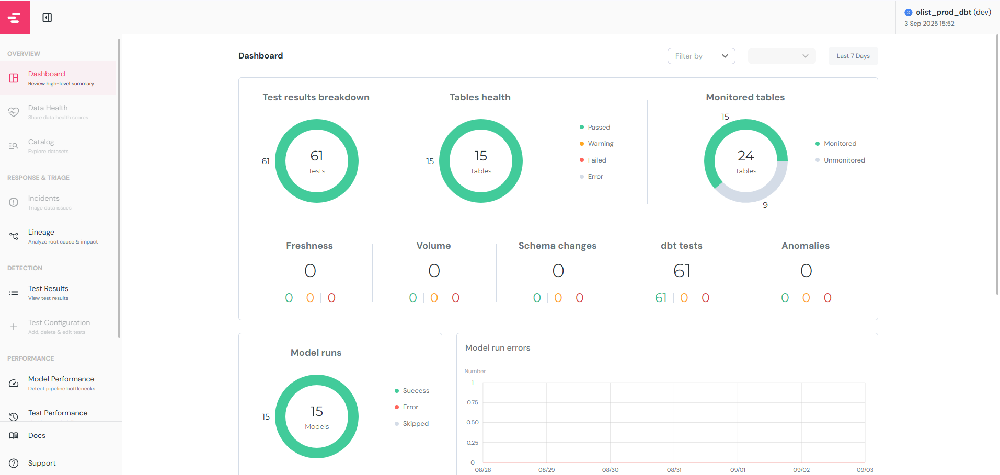
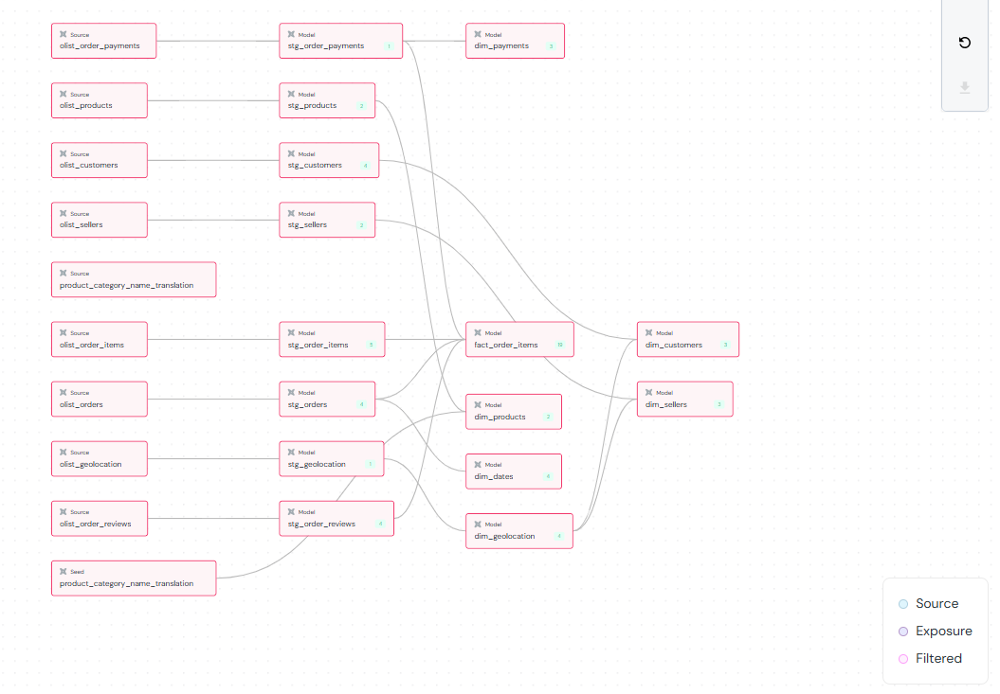
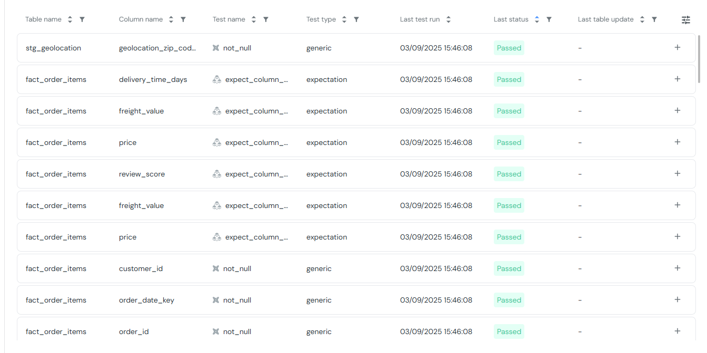

## Adding Elementary into dbt for dbt Test Visualisation

Elementary Data is a dbt-native dashboard that visualizes your dbt test results, monitors data quality checks, and provides insights into test failures and data health across your pipelines. It can be installed as a dbt package.

### To install dbt elementary package

- In the `/dbt_olist/packages.yml` file, add the following:

```bash
- package: elementary-data/elementary
  version: 0.19.4
```

- In `/dbt_olist/dbt_project.yml`, add the elementary schema under models:

```bash
models:
  warehouse:
    ...

  elementary:
    ## elementary models will be created in the schema '<your_schema>_elementary'
    +schema: "elementary"
```

- In `profiles.yml`, add the following below the dbt_olist profile to point the schema to elementary for big query:
```bash
## BIGQUERY ##
## By default, edr expects the profile name 'elementary'.      ##
## Configure the database and schema of elementary models.     ##
## Check where 'elementary_test_results' is to find it.        ##

elementary:
  outputs:
    dev:
      dataset: olist_prod_dbt_elementary # elementary dataset name, usually [dataset name]_elementary
      job_retries: 1
      location: US                       # elementary dataset location
      method: service-account           
      keyfile: # full path to your keyfile
      priority: interactive
      project: # GCP project id
      threads: 4
      type: bigquery
  target: dev

```

After making the changes, run the following command to install the packages for the dbt environment:

```bash
dbt deps
```
You will then need to run the following command to create the elementary table and schema in big query
```bash
dbt run --select elementary
```

Note that this command only creates the elementary table and schema, if you would like to create all the tables and schema (staging, marts, elementary), following the usual commands of `dbt seed` if you have any data for seeding, followed by `dbt run`

You can then proceed to run the `dbt test`.

After which, to generate elementary dashboard for display of the test results, run the following:
```bash
edr report
```

**Take note to ensure that the profiles.yml file is correctly defined.*

You will then see the dashbord showing the overview of the dbt tests performed.


You can also observe the data lineage:


Details on the dbt tests performed:



### **Troubleshooting**

If you run into error that the `Could not find profile named 'elementary'`, run the following command to point towards the correct profile.yml file
```bash
edr report --profiles-dir "/path/to/your/profiles.yml_directory"
```
