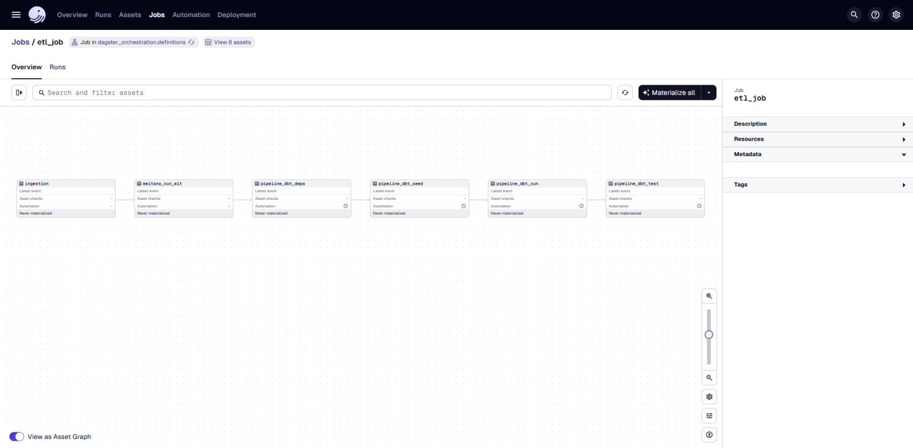
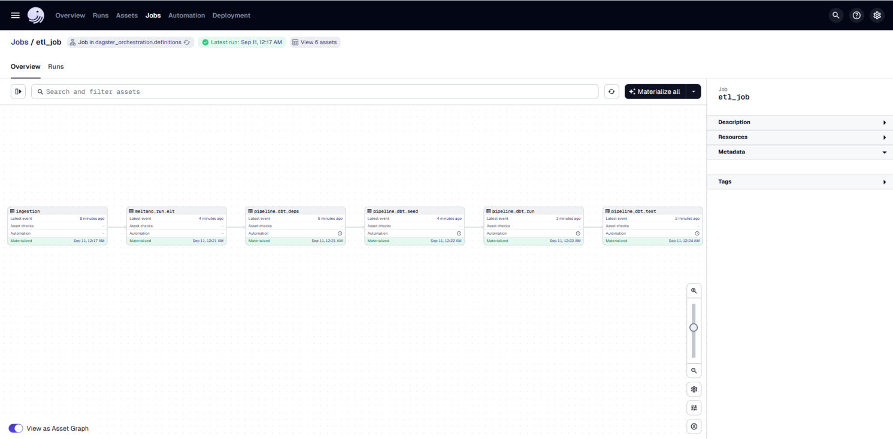

# Building End to End Orchestration

In this section, we will perform the following steps of the End-to-End ELT Pipeline.

**Step 6: Orchestration**

- **Tool:** Dagster
- **Action:** Dagster acts as the "conductor" for the entire pipeline. It automates and sequences all the above steps. It first triggers Extract-Load, then Validation, transformation and finally testing, ensuring each step runs successfully and in the correct order.
- **Output:** End to end data pipeline can now be orchestrated to run from start to end and handle incremental updates.

`Dagster` is a data orchestrator for machine learning, analytics, and ETL. It lets you define pipelines in terms of the data flow between reusable, logical components, then test locally and run anywhere. With a unified view of pipelines and the assets they produce, Dagster can schedule and orchestrate Pandas, Spark, SQL, or anything else that Python can invoke.

### Create a Dagster Project

We need to use `dagster_environment.yml` file in the [environment folder](https://github.com/su-ntu-ctp/5m-data-2.1-intro-big-data-eng/tree/main/environments) in the repository of module 2.1. Create the environment and run the following command to activate the environment:

```bash
conda activate dagster
```

Also make sure you exit the dbt folder `resale_flat` using command `cd ..`

To create a new Dagster project:

```bash
dagster project scaffold --name dagster-orchestration
```

After running this command, you should see a new directory called `dagster-orchestration` in your current directory. This directory contains the files that make up your Dagster project. 

Then switch into the folder by:

```bash
cd dagster-orchestration
```


### Create pipeline and definition file

By now, you should have a dagster-orchestration\dagster_orchestration folder.

Inside dagster-orchestration\dagster_orchestration, create "assets" folder. You should have a dagster-orchestration\dagster_orchestration\assets. We will use this folder to store out pipeline python file.

-Create am empty __init__.py file inside dagster-orchestration\dagster_orchestration\assets

```
touch __init__.py
```

-Create dbtpipeline.py inside dagster-orchestration\dagster_orchestration\assets and paste the content into the dbtpiepline.py file. This will be the python file for our dbtpipeline.

```
touch dbtpipeline.py
```

Paste content below inside dbtpipeline.py

```
from dagster import asset, get_dagster_logger, AssetKey
import os
import subprocess
# from .meltano_pipeline import meltano_run_elt

# Paths
DBT_PROJECT_DIR = os.path.join(os.path.dirname(__file__), "../../../dbt_olist")
DBT_PROFILES_DIR = DBT_PROJECT_DIR   # adjust if you later move to ~/.dbt

logger = get_dagster_logger()

def run_dbt_command(cmd: list[str]) -> str:
    """Run a dbt command and return its output, raising Exception on failure."""
    full_cmd = cmd + ["--profiles-dir", DBT_PROFILES_DIR]
    logger.info(f"Running dbt command: {' '.join(full_cmd)}")
    try:
        output = subprocess.check_output(full_cmd, stderr=subprocess.STDOUT).decode()
        logger.info(output)
        return output
    except subprocess.CalledProcessError as e:
        logger.error(e.output.decode())
        raise Exception(e.output.decode())

@asset(deps=[AssetKey("meltano_run_elt")])
def pipeline_dbt_deps() -> None:
    """Install dbt packages (from packages.yml)."""
    run_dbt_command(["dbt", "deps", "--project-dir", DBT_PROJECT_DIR])

@asset(deps=[pipeline_dbt_deps])
def pipeline_dbt_seed() -> None:
    """Runs dbt seed."""
    run_dbt_command(["dbt", "seed", "--project-dir", DBT_PROJECT_DIR])

@asset(deps=[pipeline_dbt_seed])
def pipeline_dbt_run() -> None:
    """Runs dbt run --full-refresh."""
    run_dbt_command(["dbt", "run", "--full-refresh", "--project-dir", DBT_PROJECT_DIR])

@asset(deps=[pipeline_dbt_run])
def pipeline_dbt_test() -> None:
    """Runs dbt test."""
    run_dbt_command(["dbt", "test", "--project-dir", DBT_PROJECT_DIR])

```

-Create ingestion_pipeline.py dagster-orchestration\dagster_orchestration\assets and paste the content into the file. This will be the ingestion pipeline python file.

```
touch ingestion_pipeline.py
```

Paste content below into ingestion_pipeline.py

```
import subprocess
from dagster import asset, Definitions
import pandas as pd
SCRIPT_PATH = "/home/ser/DSAI/5m-data-m2-project-2/5m-data-m2-project/scripts/ingest.py"

@asset
def ingestion():
    """Delegates dataset download/unzip to external script."""
    result = subprocess.run(["python", SCRIPT_PATH], capture_output=True, text=True)
    if result.returncode != 0:
        raise Exception(f"Script failed: {result.stderr}")
    print(result.stdout)
    return pd.DataFrame({"status": [result.returncode]})

```

-Create meltano_pipeline.py dagster-orchestration\dagster_orchestration\assets and paste the content into the file. This will be the meltano pipeline.

``` 
touch meltano_pipeline.py
```

Paste content below into the meltano_pipeline.py

```
from dagster import asset, get_dagster_logger, AssetKey
import subprocess
import os

logger = get_dagster_logger()

# Path to your Meltano project (where meltano.yml lives)
MELTANO_DIR = "/home/ser/DSAI/5m-data-m2-project-2/5m-data-m2-project/meltano-ingestion"
def run_meltano_command(cmd: list[str]) -> str:
    """Run a Meltano command and return its output, raising Exception on failure."""
    full_cmd = ["meltano"] + cmd
    logger.info(f"Running meltano command: {' '.join(full_cmd)} (cwd={MELTANO_DIR})")
    try:
        output = subprocess.check_output(
            full_cmd,
            stderr=subprocess.STDOUT,
            cwd=MELTANO_DIR
        ).decode()
        logger.info(output)
        return output
    except subprocess.CalledProcessError as e:
        logger.error(e.output.decode())
        raise Exception(e.output.decode())

@asset(deps=[AssetKey("ingestion")])
def meltano_run_elt() -> None:
    """Run the Meltano pipeline: tap-csv -> target-bigquery."""
    run_meltano_command(["run", "tap-csv", "target-bigquery"])
```


Then go to dagster-orchestration\dagster_orchestration

-Create am empty __init__.py file inside dagster-orchestration\dagster_orchestration\assets

```
touch __init__.py
```

-Create definitios.py in dagster-orchestration\dagster_orchestration and paste the content below into the file. This is where we define our dagter job.

```
touch definitios.py
```

Paste content below into the definitios.py

```
from dagster import (
    AssetSelection,
    Definitions,
    ScheduleDefinition,
    define_asset_job,
    load_assets_from_modules,
)
from dagster_duckdb_pandas import DuckDBPandasIOManager


from .assets import dbtpipeline
from .assets import meltano_pipeline  # <-- import the Meltano asset
from .assets import ingestion_pipeline


# define the job that will materialize the assets


dbt_assets = load_assets_from_modules([dbtpipeline])
meltano_assets = load_assets_from_modules([meltano_pipeline])
ingestion_assets = load_assets_from_modules([ingestion_pipeline])

from dagster import define_asset_job

# Define jobs
etl_job = define_asset_job(
    name="etl_job",
    selection=[
        "ingestion",
        "meltano_run_elt",          # Meltano first
        "pipeline_dbt_deps",
        "pipeline_dbt_seed",        # then dbt seed
        "pipeline_dbt_run",         # dbt run
        "pipeline_dbt_test",        # dbt test
    ]
)

dbt_only_job = define_asset_job(
    name="dbt_pipeline",
    selection=["pipeline_dbt_deps","pipeline_dbt_seed", "pipeline_dbt_run", "pipeline_dbt_test"]
)

# Schedule dbt_only_job to run every day at midnight
dbt_schedule = ScheduleDefinition(
    job=dbt_only_job,
    cron_schedule="0 0 * * *"
)

# IO manager
database_io_manager = DuckDBPandasIOManager(database="analytics.pandas_releases")

# Definitions
defs = Definitions(
    assets=[*dbt_assets, *meltano_assets, *ingestion_assets],
    jobs=[etl_job, dbt_only_job],  # <-- include the jobs here
    schedules=[dbt_schedule],
    resources={
        "io_manager": database_io_manager,
    },
)

```

### Run the dagster
Go to path dagster-orchestration and run

```
dagster dev -m dagster_orchestration.definitions
```


### Dagster GUI

After succussful deployment, here are snapshot views of the dashboard:

Before materialize


After materialize
