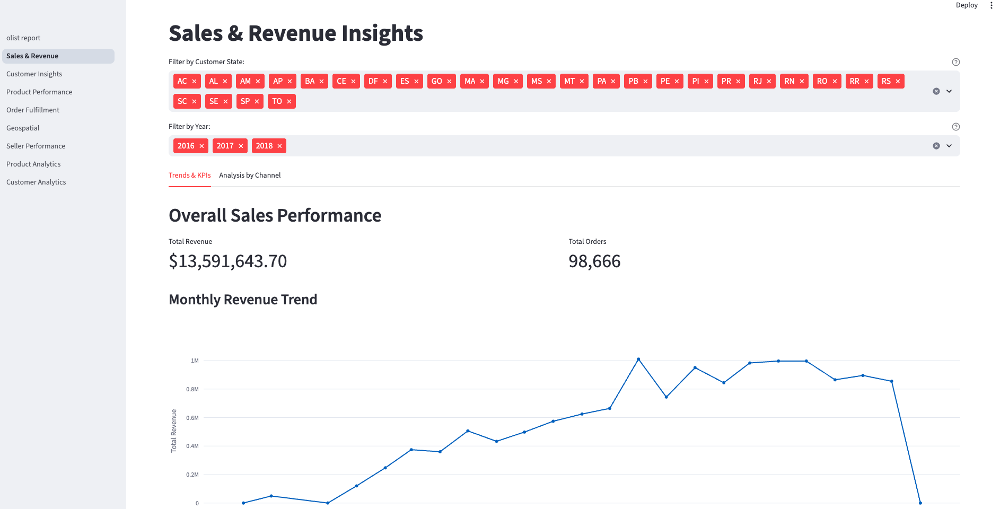
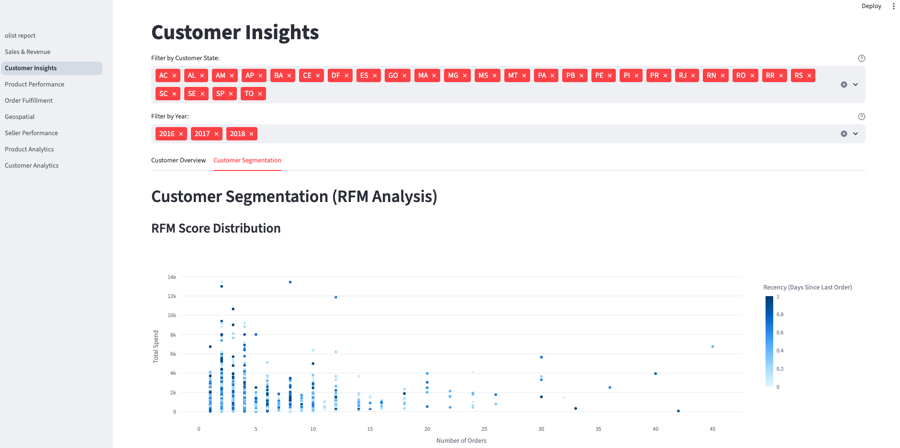
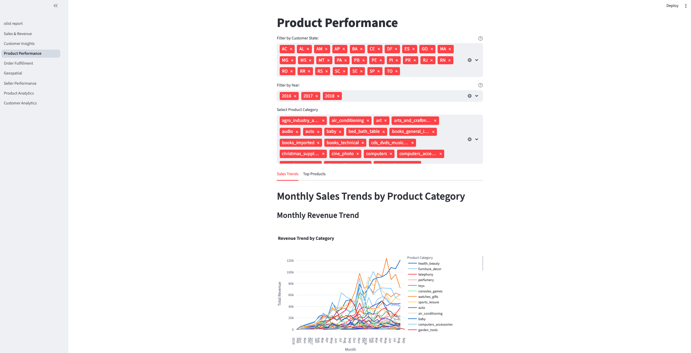
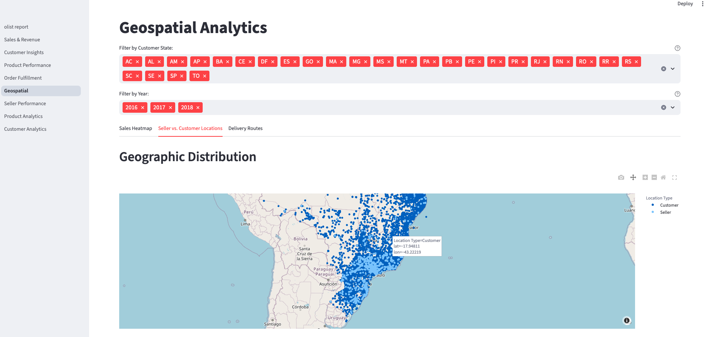

# Data Analysis through Visualization

In this section, we will perform the following steps of the End-to-End ELT Pipeline.

**Step 7: Analysis**

- **Tool:** streamlit
- **Action:** With the data now clean and in a star schema, BI tools can connect directly to the production schema in the data warehouse to create dashboards and reports for advanced analytics.
- **Output:** Dashboard or reports can be created through data visualization to gain insights into the data.

## 1. Data Visualization Tool

There are several choices of tool with pros and cons, streamlit is chosen due to it's advanced visualization where it excels at story telling.

Below is a list of potential candidates and their key features:

#### Free / Open Source Options for BigQuery

a.	Looker Studio (Data Studio)
	•	100% free.
	•	Natively connects to BigQuery.
	•	Drag-and-drop dashboards, filters, KPIs.
	•	Downsides: performance issues on very large queries, fewer advanced charts.

b.	Metabase (open source)
	•	Free to self-host (Docker/JAR).
	•	Native BigQuery driver.
	•	Simple question/answer style queries → dashboards.
	•	Great for a small team, super easy setup.

c.	Apache Superset (open source)
	•	Free, enterprise-grade BI.
	•	BigQuery connector available.
	•	Strong dashboards, advanced charting, permissions.
	•	Heavier setup (needs Docker/K8s, some devops).
d.	Google Sheets + Connected Sheets
	•	Also free.
	•	Can query BigQuery directly, visualize with Sheets charts/pivots.
	•	Good for analysts who live in spreadsheets.

e. Streamlit
	•	It’s not a BI tool, it’s a Python framework for quickly building interactive web apps.
	•	100% free, open source.
	•	You can query BigQuery with the Python client (google-cloud-bigquery) and visualize using Plotly, Altair, or Matplotlib.
	•	Full flexibility: custom KPIs, charts, even ML integrations.
	•	Deploy to Streamlit Community Cloud (free for small apps) or your own infra.
	•	Requires Python skills.
	•	You’ll be responsible for writing queries, caching, and layouts.
	•	Not as “plug and play” as Looker Studio/Tableau.

## 2. Tool Setup

Create conda environment with python version 3.9 to 3.13. In this case 'elt'

Activate the conda env:
```
conda activate elt
```
Install streamlit:
```
pip install streamlit
```
Test that the installation worked by launching the Streamlit Hello example app:
```
streamlit hello
```
Develop your app and save as ecomapp.py, run your streamlit app:
```
streamlit run ecomapp.py
```

## 3. Visualization Features

i. BigQuery Integration
	•	Connected to BigQuery m2_prod dataset.
	•	Supports service account JSON authentication via environment variable (GOOGLE_APPLICATION_CREDENTIALS).
	•	Optionally works with gcloud OAuth credentials for local dev.

ii. Data Extraction & Transformation
	•	Pulls data from fact_order_items and all dimension tables (dim_customers, dim_sellers, dim_products, dim_dates, dim_payments, dim_geolocation).
	•	Handles missing or optional data using LEFT JOIN and COALESCE.
	•	Cleans and casts timestamp columns for consistent date/time handling.

iii. Filters & Parameters
	•	Sidebar filters:
	•	Order date range
	•	Customer state
	•	Payment type
	•	Route map controls:
	•	Max number of orders to plot
	•	Sampling method: First N or Random
	•	Refresh routes dynamically

iv. KPIs
	•	Total Orders (order_id count)
	•	Total Revenue (price sum)
	•	Average Review Score

v. Charts
	•	Revenue by Review Score (histogram)
	•	Delivery Time Distribution (histogram)
	•	Top-N Product Categories by revenue (bar chart, dynamically configurable)

vi. Geospatial Features
	•	Customer & Seller Geolocation Map (scatter_mapbox)
	•	Delivery Routes Map:
	•	Plots lines from seller → customer
	•	Distance calculated using Haversine formula
	•	Color gradient reflects distance traveled
	•	Caching of route calculations for performance (@st.cache_data)

vii. Seed & Reference Table Integration
	•	Product category translation (product_category_name_translation.csv) used to convert Portuguese categories → English.
	•	Loaded via dbt seed, referenced in dim_products.

viii. Incremental & Efficient Data Loading
	•	Queries are cached (@st.cache_data) to reduce repeated BigQuery queries.
	•	Fact table supports incremental loading (via dbt) for daily/weekly updates.

ix. Data Download
	•	Download filtered dataset as CSV directly from Streamlit.
	•	Handles all applied filters.

x. dbt Integration Features
	•	Full dbt star schema: staging, dimensions, incremental fact table.
	•	Tested for:
	•	Primary key uniqueness and not null
	•	Relationships / foreign keys between fact → dimension tables
	•	dbt ensures data quality and lineage.

xi. Performance & UX Enhancements
	•	Handles large datasets efficiently using:
	•	Incremental fact table processing
	•	Map sampling for routes
	•	Cached BigQuery results
	•	Dynamic sidebar for interactive filtering
	•	Fully responsive layout using st.columns and plotly.express charts

### 4. Data Visualization Developement:

Before running the app, set the service account credentials to OS env variable:
```
export GOOGLE_APPLICATION_CREDENTIALS="/path/to/service_account.json"
```
#### ecomapp.py code:
```
import os
import streamlit as st
import pandas as pd
import plotly.express as px
from google.cloud import bigquery
from math import radians, cos, sin, asin, sqrt

# -------------------------
# BigQuery Configuration
# -------------------------
KEY_PATH = os.getenv("GOOGLE_APPLICATION_CREDENTIALS")
if not KEY_PATH or not os.path.exists(KEY_PATH):
    st.error("BigQuery credentials not found. Set GOOGLE_APPLICATION_CREDENTIALS to your service account JSON path.")
    st.stop()

PROJECT_ID = "sound-vehicle-468314-q4"
DATASET_NAME = "m2_prod"
LOCATION = "US"

client = bigquery.Client.from_service_account_json(
    KEY_PATH,
    project=PROJECT_ID,
    location=LOCATION
)

# -------------------------
# Table references
# -------------------------
TABLE_FACT_ORDER_ITEMS = f"{PROJECT_ID}.{DATASET_NAME}.fact_order_items"
TABLE_DIM_CUSTOMERS = f"{PROJECT_ID}.{DATASET_NAME}.dim_customers"
TABLE_DIM_PRODUCTS = f"{PROJECT_ID}.{DATASET_NAME}.dim_products"
TABLE_DIM_SELLERS = f"{PROJECT_ID}.{DATASET_NAME}.dim_sellers"
TABLE_DIM_DATES = f"{PROJECT_ID}.{DATASET_NAME}.dim_dates"
TABLE_DIM_PAYMENTS = f"{PROJECT_ID}.{DATASET_NAME}.dim_payments"
TABLE_DIM_GEO = f"{PROJECT_ID}.{DATASET_NAME}.dim_geolocation"

# -------------------------
# Utility functions
# -------------------------
def haversine(lat1, lon1, lat2, lon2):
    # Calculate distance in km between two lat/lon points
    lon1, lat1, lon2, lat2 = map(radians, [lon1, lat1, lon2, lat2])
    dlon = lon2 - lon1
    dlat = lat2 - lat1
    a = sin(dlat/2)**2 + cos(lat1)*cos(lat2)*sin(dlon/2)**2
    return 6371 * 2 * asin(sqrt(a))

@st.cache_data(ttl=3600)
def query_bq(sql):
    df = client.query(sql).to_dataframe()
    return df

# -------------------------
# Sidebar filters
# -------------------------
st.sidebar.header("Filters")
date_range = st.sidebar.date_input("Order Date Range", [])
customer_state = st.sidebar.multiselect("Customer State", [])
payment_type = st.sidebar.multiselect("Payment Type", [])

# -------------------------
# Build WHERE clause dynamically
# -------------------------
filters = []
if date_range and len(date_range) == 2:
    filters.append(f"order_date_key BETWEEN {int(date_range[0].strftime('%Y%m%d'))} AND {int(date_range[1].strftime('%Y%m%d'))}")
if customer_state:
    states = ", ".join([f"'{s}'" for s in customer_state])
    filters.append(f"customer_state IN ({states})")
if payment_type:
    types = ", ".join([f"'{p}'" for p in payment_type])
    filters.append(f"payment_type_key IN ({types})")

where_clause = f"WHERE {' AND '.join(filters)}" if filters else ""

# -------------------------
# Load fact + dimensions
# -------------------------
sql_fact = f"""
SELECT f.*, c.customer_state, s.seller_state
FROM `{TABLE_FACT_ORDER_ITEMS}` f
LEFT JOIN `{TABLE_DIM_CUSTOMERS}` c ON f.customer_id = c.customer_id
LEFT JOIN `{TABLE_DIM_SELLERS}` s ON f.seller_id = s.seller_id
{where_clause}
"""
df_fact = query_bq(sql_fact)

# Fix data types for numeric calculations
df_fact["price"] = pd.to_numeric(df_fact["price"], errors="coerce").fillna(0)
df_fact["review_score"] = pd.to_numeric(df_fact["review_score"], errors="coerce")

st.title("Olist E-Commerce Dashboard")

# -------------------------
# KPIs
# -------------------------
st.subheader("Key Metrics")
total_orders = len(df_fact)
total_revenue = df_fact["price"].sum()
average_review_score = df_fact["review_score"].mean() if not df_fact.empty else 0

col1, col2, col3 = st.columns(3)
col1.metric("Total Orders", total_orders)
col2.metric("Total Revenue", f"${total_revenue:,.2f}")
col3.metric("Average Review Score", f"{average_review_score:.2f}")

# -------------------------
# Revenue by Review Score
# -------------------------
st.subheader("Revenue by Review Score")
rev_by_score = df_fact.groupby("review_score")["price"].sum().reset_index()
fig_rev = px.bar(
    rev_by_score,
    x="review_score",
    y="price",
    labels={"price": "Revenue", "review_score": "Review Score"},
    title="Revenue by Review Score"
)
st.plotly_chart(fig_rev, use_container_width=True)

# -------------------------
# Delivery Time Distribution
# -------------------------
st.subheader("Delivery Time Distribution (Days)")
fig_del = px.histogram(
    df_fact,
    x="delivery_time_days",
    nbins=30,
    labels={"delivery_time_days": "Delivery Time (days)"},
    title="Delivery Time Distribution"
)
st.plotly_chart(fig_del, use_container_width=True)

# -------------------------
# Top Products
# -------------------------
st.subheader("Top Products by Revenue")
sql_top_products = f"""
SELECT p.product_category_name_english AS category, SUM(CAST(f.price AS FLOAT64)) AS revenue
FROM `{TABLE_FACT_ORDER_ITEMS}` f
LEFT JOIN `{TABLE_DIM_PRODUCTS}` p ON f.product_id = p.product_id
{where_clause}
GROUP BY category
ORDER BY revenue DESC
LIMIT 10
"""
df_top = query_bq(sql_top_products)
fig_top = px.bar(
    df_top,
    x="category",
    y="revenue",
    labels={"revenue":"Revenue", "category":"Product Category"},
    title="Top 10 Product Categories by Revenue"
)
st.plotly_chart(fig_top, use_container_width=True)

# -------------------------
# Geospatial Maps
# -------------------------
st.subheader("Customer & Seller Locations")

sql_geo = f"""
SELECT c.customer_id, c.customer_city, c.customer_state, c.latitude AS cust_lat, c.longitude AS cust_lon,
       s.seller_id, s.seller_city, s.seller_state, s.latitude AS seller_lat, s.longitude AS seller_lon
FROM `{TABLE_FACT_ORDER_ITEMS}` f
LEFT JOIN `{TABLE_DIM_CUSTOMERS}` c ON f.customer_id = c.customer_id
LEFT JOIN `{TABLE_DIM_SELLERS}` s ON f.seller_id = s.seller_id
{where_clause}
"""
df_geo = query_bq(sql_geo)

fig_map = px.scatter_mapbox(
    df_geo, lat="cust_lat", lon="cust_lon",
    hover_name="customer_id",
    color_discrete_sequence=["blue"],
    zoom=3,
    height=400,
    title="Customer Locations"
)
fig_map.add_scattermapbox(
    lat=df_geo["seller_lat"],
    lon=df_geo["seller_lon"],
    mode="markers",
    marker=dict(color="red", size=8),
    text=df_geo["seller_id"],
    name="Sellers"
)
fig_map.update_layout(mapbox_style="open-street-map")
st.plotly_chart(fig_map, use_container_width=True)

# -------------------------
# Delivery Routes Map
# -------------------------
st.subheader("Delivery Routes")
sample_size = st.slider("Max routes to display", min_value=100, max_value=1000, value=200, step=50)
df_routes = df_geo.head(sample_size).copy()
df_routes["distance_km"] = df_routes.apply(
    lambda row: haversine(row.seller_lat, row.seller_lon, row.cust_lat, row.cust_lon),
    axis=1
)

# To plot lines on mapbox, build lines as scatter traces (one per route)
import plotly.graph_objects as go

fig_routes = go.Figure()

for _, row in df_routes.iterrows():
    fig_routes.add_trace(go.Scattermapbox(
        mode="lines+markers",
        lat=[row["seller_lat"], row["cust_lat"]],
        lon=[row["seller_lon"], row["cust_lon"]],
        line=dict(width=2, color=px.colors.sequential.Viridis[int(row["distance_km"]) % len(px.colors.sequential.Viridis)]),
        marker=dict(size=6),
        hoverinfo="text",
        text=f"Distance: {row['distance_km']:.2f} km<br>Customer ID: {row['customer_id']}"
    ))

fig_routes.update_layout(
    mapbox=dict(style="open-street-map", zoom=3, center={"lat": df_routes["cust_lat"].mean(), "lon": df_routes["cust_lon"].mean()}),
    height=500,
    margin={"r":0,"t":0,"l":0,"b":0},
    title="Delivery Routes with Distances"
)
st.plotly_chart(fig_routes, use_container_width=True)

# -------------------------
# Data download
# -------------------------
st.subheader("Download Filtered Data")
csv = df_fact.to_csv(index=False)
st.download_button("Download CSV", data=csv, file_name="olist_filtered_data.csv", mime="text/csv")
```

### 5. Data Visualization in Action:

After succussful deployment, here are snapshot views of the dashboard:







#### Sample Filtered Data CSV:
[Download CSV](./assets/olist_filtered_data.csv)

## Next Phase:

Additional views can be built to gain more in depth insights, below are proposed for next phase:

### Additional Views and Insights

#### a. Sales & Revenue Insights

Monthly/Quarterly Revenue Trend
Visualize revenue over time to spot seasonality, growth trends, or dips.
Implementation: Group orders by month/quarter and sum revenue, then line/bar chart.

Average Order Value (AOV)
Revenue divided by number of orders over a period to measure spending per order.
Implementation: total_revenue / total_orders.

Customer Lifetime Value (CLV)
Estimate how much revenue a customer generates over their lifetime.
Implementation: Aggregate revenue per customer, maybe cohort analysis.

Revenue by Channel / Payment Type
Compare revenue generated from different payment methods or sales channels.

#### b. Customer Insights

Customer Segmentation
Group customers by location, spending behavior, or order frequency.
Implementation: Use RFM (Recency, Frequency, Monetary) analysis.

Repeat Purchase Rate
Percentage of customers who made more than one purchase.

New vs Returning Customers Over Time
Show how many new customers vs returning customers are ordering per period.

#### c. Product Performance

Product Category Sales Trends
Show how different categories perform over time.

Top Products by Units Sold
Complement top revenue products with volume sold.

Product Return Rate
If you have returns data, calculate return rates by product or category.

#### d. Order Fulfillment & Delivery

Average Delivery Time Trend
Show how delivery time improves or worsens over time.

Delivery Time by Seller or Region
Identify sellers or locations with slower/faster delivery.

Late Delivery Rate
Percentage of orders delivered past expected date.

#### e. Geospatial Analytics

Sales Heatmap by State or City
Map showing revenue density geographically.

Seller vs Customer Distance Distribution
Visualize average delivery distances, identify remote areas.

Delivery Route Optimization Suggestions
Using clustering or routing algorithms to suggest efficiency improvements.

#### f. Operational KPIs

Payment Failure Rate
Show how often payment attempts fail by payment type.

Order Cancellation Rate
Percentage of orders canceled after placement.

Inventory Alerts
Highlight products low in stock (if inventory data available).

#### g. User Experience & Feedback

Review Score Distribution Over Time
Track customer satisfaction trends.

Sentiment Analysis on Reviews
If you have textual reviews, analyze positive/negative sentiment.

#### h. Advanced Analytics

Churn Prediction
Identify customers at risk of not returning.

Cross-sell & Upsell Opportunities
Analyze frequently bought together products.

Forecasting
Predict future sales or demand by product or region.

#### Bonus: Interactive Features

Dynamic Drilldowns
Click on a product/category or region to drill deeper.

Custom Date Range & Comparison
Compare KPIs between two selected periods.

Alerts & Notifications
Show warnings if KPIs fall below targets.