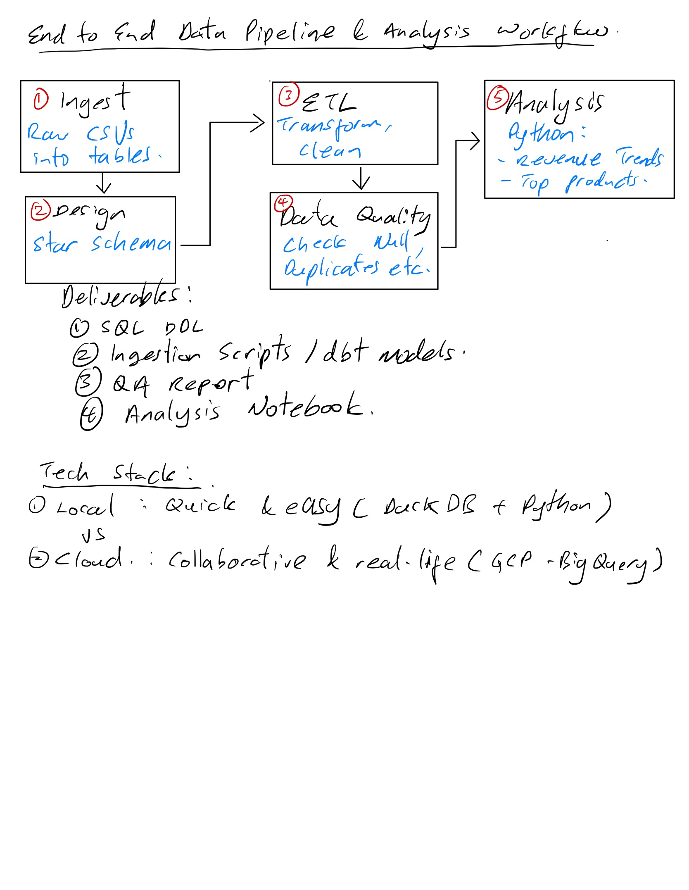
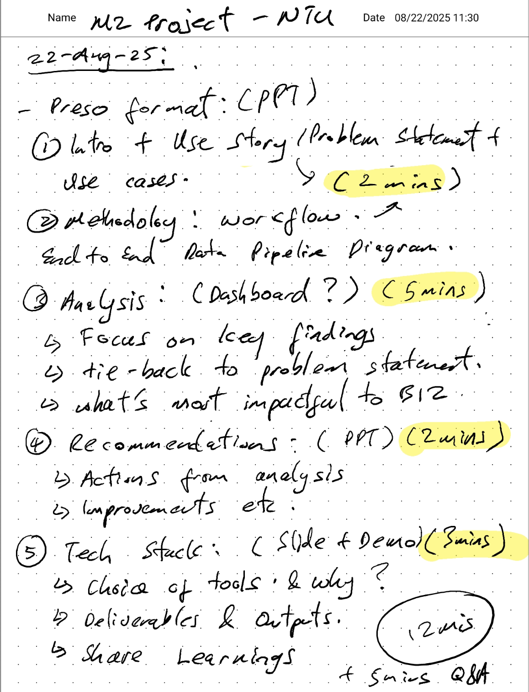
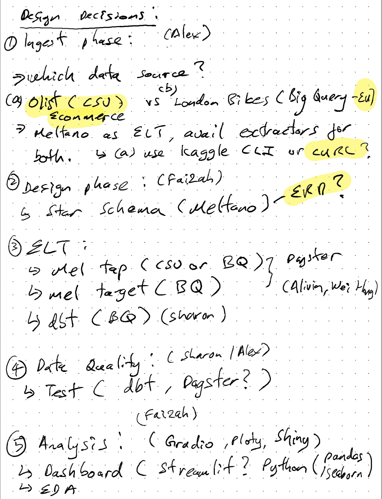

# End to end Workflow

Documents the end to end workflow, overall design principles, deliverables and selected tech stack

## Overview of the workflow and phases:

## Approach for each phase, assigned Leader for each component. Leader leads the component while all members contribute to the development process:

